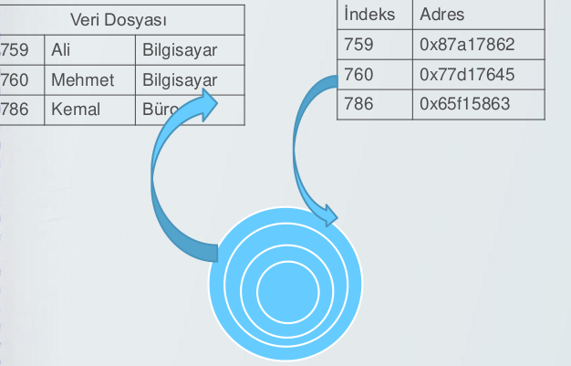
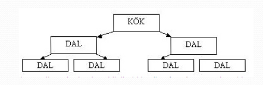
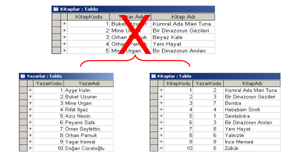

# 1. Temel Kavramlar

- Veri olguların, kavramların, veya talimatların, insan tarafından veya otomatik yolla iletişim, yorumlama ve işleme amacına uygun bir biçimde ifadesidir.
- Genellikle, biz veri veya veri birimleri üzerindeki işlemlerimizi varlık hakkında her hangi bilgi almak için gerçekleştiririz. Veri kaydedilebilir bilinen gerçeklerdir. Örneğin bir kişinin ismi, adresi, telefon numarası gibi.

## 1.1 Klasik-Geleneksel Dosya Yapıları
- Veri saklama birimlerinde depolana veri topluluklarına "dosya" adı verilmektedir.
- Dosyalar ise kendi içerisinde kayıtlara bölünmüştür
- Örneğin öğrencilerin bilgilerinin tutulduğu bir dosyayı düşünebiliriz.
- Vtys öncesi kullanılan sistemlerdir ve karmaşık olmayan,basit verilerin tutulduğu sistemlerdir.

- Sıralı erişimli dosyalar
    - Veri işleme sıralı erişim yöntemi ile
    - Herhangi bir bilgiye ulaşmak için dosya veri bulunana kadar okunur.
    - Eski müzik kasetleri sıralı erişime güzel bir örnek. Kasetin 7. şarkısını dinlemek için ilk şarkıyı dinlemek zorundasın.
    - Verileri ayırmak için özel karakter kullanılır.
    - Veriye anında erişmek zor.

    

- Doğrudan erişimli dosyalar
    - Oluşma nedeni;Sıralı erişimli dosyalarda veriye ulaşmak için dosyanın tamamen taranması.
    - Veriye doğrudan erişim söz konusu.
    - DED her satır için indeks bilgisine sahiptir(benzersiz) yani her bir satırın indeks değeri ve bellek bilgisine sahip.
    - Aranan verinin karşılık geldiği indeks değerinin göstermiş olduğu adres okunarak bilgiye ulaşılır.

    

## 1.2 Dosya Sistemlerinin Sakıncaları

- **Veri Tekrarı:** Aynı veri çeşitli dosyalar birden fazla yer alabilmektedir.Buda sistemin hantallaşmasına neden olur.Mesela bir stok dosyasında stok numarasını verisinin malzeme dosyasında, fatura dosyasında ve depo girişi dosyasında yer alması gibi.
- **Verinin dosyaların hepsinde güncellenmemesi:** Veri birden fazla dosyada tekrar edilebildiği için, verinin bir dosyada güncellenip diğerlerinde güncellenmemesi Veri Bütünlüğünün (Data Integrity) bozulmasına neden olabilir. Buna bağlı olarak birbiri ile çelişen raporlar üretilebilir.
- **Belleğin tekrarlı bilgi nedeniyle israfı:** Aynı verinin birden fazla dosya içinde bulunması nedeniyle kullanılan veri hard diskte fazla
yer işgal edecek. Yani hard disk tekrarlı veriler için kullanılmış olacaktır.
- **Sadece belirli bir dilin kullanılması:** Verilerin dosya sisteminde saklandığı ortamlar için değişik programlama dillerinden bir tanesi kullanılır. Kullanılan bu programlama dili ise SQL dili gibi esnek değildir.

## 1.3 Veri Tabanı Yönetim Sistemlerinin Sınıflandırılması
- **Veri Modeline Göre**
    - **Hiyerarşik:** Veri tabanları için kullanılan ilk modeldir Hiyerarşik veritabanları bilgileri bir ağaç yağısında saklarlar.
    
    - Olumsuz yanları:
        - Her varlık tek varlığa bağlı.
        - Arama kökten dallara.
        - Kökten veri silinirse dallar silinir.
    - **Ağ:** Hiyerarşik veritabanları yetersiz kalınca 1960’ların sonunda verilerin ağaçların daha gelişmiş hali olan graflar şeklinde saklandığı yapı ortaya çıkmıştır.
    
    - Olumsuz yanları: karşık olması
    - **İlişkisel:** 1970’lerin başında geliştirilmiştir. Bu sistemde veriler tablo şeklinde saklanır. Tablolar arasındaki bağlantılar matematiksel ilişkilerle gösterilir. Günümüzdeki hemen hemen tüm veri tabanı programları bu yapıdadır.
    
    - **Nesneye Yönelik:** Günümüzdeki pek çok kelime işlemci ve hesap tablosu programında kullanılan nesneler artık veritabanlarında da kullanılmaktadır.Nesneye yönelik veritabanı C++ gibi nesneye yönelik bir dille oluşturulan ve yine bu tarz bir dille kulanılan veri tabanı anlamına gelir.
- **Kullanıcı Sayısına Göre**
    - Tek kullanıcılı
    - Çok kullanıcılı

## 1.3 Veri Tabanı Nedir
- Birden çok uygulama tarafından kullanılan 
- Gereksiz yinelemelerden arınmış.
- Düzenli bir şekilde saklanan
- Birbiriyle ilşkili (uyumlu olarak) 
- Sürekli , fakat statik olmayan 
- Belirli bir amaç için bir araya getirilmiş
- VERİ TOPLULUĞU (küçük bir dünya)’dur.

Örnek: şirket, bakanlık, üniversite, market stok takip....

**Tablo**
Bir veritabanı tablolarda saklanan verilerden oluşur. Tablolar verilerin satırlar ve sütunlar halinde düzenlenmesiyle oluşan veri grubudur. Örneğin ders içeriği ve öğrenci bilgilerini veritabanında saklamak için 2 tablo oluşturulur:Ogrenci_bilgileri ve icerik

Tablo içindeki her bir  bilgi kayıt, Sütunlar ise alan olarak isimlendirilir. Örneğin öğrenci bilgileri tablosunda Öğrenci numarası, adı soyadı, doğum tarihi, doğum yeri, e-mail adresi bilgileri yer alacaksa

---
# 2. Veri tabanı Yönetim Sistemleri

Veri tabanı tanımlamak, yaratmak, yaşatmak ve veri tabanına denetimli erişim sağlamak için kullanılan yazılım sistemidir.

Veri Tabanı Yönetim Sistemleri,fiziksel hafızada bilgileri çeşitli özelliklerine göre gruplandırıp şekillendirdikten sonra saklayan programlardır.VTYS, saklanan bu veriyi, Yapısal Sorgulama komutları ile insanların istekleri çerçevesinde işler,yeniden şekillendirirler. Yani, Veritabanı Yönetim Sistemi’nin bir ucunda, bilgisayar diskinde saklanan düzenlenmiş veriler, diğer ucunda ise bir kullanıcı (genellikle insan) veya istemci vardır.Aynı veri tekrar tekrar tutulmaz.

Vtys'ler ilişkili olan veriler **(Collection of interrlated data)** ve veriye ulaşmak için gerekli olan yazılımlar kümesini bünyelerinde barındırırlar.

1. **Data Redundancy (Veri Tekrarı):** Veri tekrarı azalır yada yok edilir
2. **Data Consistency (Veri Tutarlılığı):** Aynı verinin değişik yerlerde birkaç kopyasının bulunması bakım zoruluğu getirir:Bir yerde güncellenen bir adres bilgisi başka yerde güncellenmeden kalabilir ve bu veri tutarsızlığı (Data Inconsistency) yol açar.
3. **Concurrency (Veri Paylaşımı/Eş zamanlılık):** VTYS kullanılmadığı durumlarda veriye sıralı erişim yapılır yani birden çok kullanıcı aynı anda aynı veriye erişemez.Bir VTYS'de bir veriye saniyede binlerce kullanıcı erişebilir.
4. **Data Integrity (Veri Bütünlüğü):** Bir tablodan bir öğrenci kaydı silinirse öğrenci var olduğu tüm tablolardan silinmelidir.
4. **Data Security (Veri Güvenliği):** Verinin isteyerek ya da yanlış kullanım sonucu bozulmasını önlemek için çok sıkı mekanizmalar mevcuttur.Veri tabanına girmek için kullanıcı adı ve şifreyle korumanın yanı sıra kişiler sadece kendilerini ilgilendiren tabloları yada tablo içinde belirli kolonları görebilir.
5. **Data Independence (Veri Bağımsızlığı):** Programcı kullandığı verilerin yapısı ve organizasyonu ile ilgilenmek durumunda değildir.Veri Bağımsızlığı VTYS'lerin en temel amaçlarındandır.  

---
# 3. The Entity-Relationship Model (Varlık-İlişki Modeli)

- Veri çözümleme ve modellemede ilişkilerin ortaya konması için kullanılan araçtır.
- **Varlık (Entity)**: Bir alan içerisinde diğer nesnelerden ayırt edilebilen bir şey **(thing)** yada nesne **(object)** olarak tanımlanır.
- Niteliklerin kümesi **(set of attributes)** tarafından tanımlanır.
- **İlişki (relationship)**:Birden fazla varlığın arasındaki bağıntı-ilişki.
- Gorsel olarak varlık-ilişki tablosu ile gösterilir.

- **Varlık (Entity):** Var olan ve diğer varlıklardan ayırt edilebilen nesnedir. (Bir kitap, öğrenci, veritabanı dersi) birer varlıktır.
- **Varlık Dizisi:** Aynı türdeki varlıklar varlık kümesini oluştururlar. Bir okuldaki tüm
öğrenciler “öğrenci” isimli varlık kümesi olarak değerlendirilir.

## 3.2 İlişki ve İlişki Modeli 
Varlıklar arasındaki bağlantıya ilişki adı
verilir.örneğin “Burak” varlığı ile “Dersler”
varlığı arasından ilişki vardır. İlişki kümesi, aynı türdeki ilişkilerin kümesidir,
bu ilişki kümesi R ile gösterilir. E1, E2, ..., En varlık kümeleri, R ise ilişkiyi
tanımlamaktadır.

E1={Ayşe,Burak}     
E2={Elektronik, İngilizce}      
Bu iki küme arasındaki ilişki, öğrenciler ve
dersler arasındaki ilişkidir. Tüm öğrencilerle
tüm dersler arasındaki ilişki kartezyen
çarpımı yapılarak ifade edilir.     
E1xE2={(Ayşe,Elektronik),(Ayşe,İngilizce),
(Burak, Elektronik),(Burak,İngilizce)}      
İki veri kümesi arasındaki geçerli tüm ilişkiler, R ilişki kümesinin bir alt kümesidir.     

      
- Niteliğin aldığı değerlere **(domain)** denir     
      

## 3.3 Türetilen Nitelik
- Bir nitelik kullanılarak, bir başka varlık nitelik
elde edilebiliyorsa bu yeni niteliğe “türetilen
nitelik” adı verilir.
- Örneğin personel varlığının “doğum tarihi” niteliğinden yararlanılarak “yaş” niteliği elde edilebilir.

## 3.4 Çok Değere Sahip Nitelik
- Bir nitelik birden fazla değer ile eşleşebiliyor
ise, “çok değere sahip nitelik” adı verilir.
- Örneğin, öğretmen varlığının dersler niteliği
birden fazla değeri kapsar. Bir öğretmen
birden fazla derse girmektedir.
- Öğrenci varlığının okuduğu kitaplar niteliği
birden fazla kitabı kapsayabilir.

## 3.5 Varlıklar Arası İlişkiler(Eşleme)
- Bir varlıkla ilişkiye girilebilecek varlıkların sayısına **eşleme sayısı** adı verilir.
- Eşleme sayısı n>=2 varlık için söz konusudur ve ikili ilişkilerin ortaya konulması açısından yararlıdır.
- A ve B gibi iki varlık kümesi arasındaki R ilişki
kümesi için eşleme durumları şu şekilde ifade edilir:       
    - **(One to One)** (Birden-bire) 
    - **(One to Many)** (Birden-çoğa)
    - **(Many to One)** (Çoktan-bire)
    - **(Many to Many)** (Çoktan-çoğa)

A varlık kümesi içindeki bir varlık, B kümesi
içindeki sadece bir varlık ile ilişkili ise birden-
bire ilişki söz konusudur. 

A kümesi içindeki bir varlık B kümesi içindeki birden fazla varlıkile ilişkili ise, bu ilişkiye birden-çoğa ilişki adı verilir.B kümesindekibir varlık, A kümesindeki sadece bir varlık ile eşleşebilir. 

Çoktan-bire ilişki, bir çok dersi tek bir öğretmen verebilir. 

Çoktan-Çoğa ilişki en genel ilişki biçimidir.Bu ilişki herhangi bir sınırlamanın olmadığı durumlar için geçerli olacaktır.  
(burada bahsedilen konuda bir banka düşünelim banka sadece bir müşteri için bir hesap açabiliyor bu durumda bu banka için veri tabanı tasarımına göre müşteri ve hesap ilişkisi birden-bire olacaktır aynı durumda bankamız ortak hesap imkanı sunduğunu varsayarsak aile üyelerinin bir hesap üzerinde aitliği olabilir bu ise çoktan-çoğa ilişki denemektir.yani birden n>=2 kuralımıza göre herkesin bir den fazla hesabı olmuş olur bunu çoktan-çoğa olarak tanımlamış oluruz, bankamız zaten bir müşteri için birden çok hesap imkanı sunuyorsa o zaman bu bankamız için hesap ve müşteri ilişkisi yine çoktan-çoğa olmuş olur). 

- Varoluş Koşulu: Eğer bir x varlığının bulunması y varlığının bulunmasına bağlı ise x'in y'ye bağlı olduğundan söz edilebilir.y silinirse x'in bir anlamı kalmayacaktır.Bu durumda y bakın varlık **(dominant entity)**, x ise bağımlı varlık **(subordinate entity)** adı verilir.
    - örneğin bir müşterinin hesabı silineceğinde,bu müşterinin hesap hareketlerinin de silinmesi gerekmektedir.Hesap hareketleri hesap varolmadan var olamaz.
## 3.6 Anahtar
- Varlık kümesi içinde, varlıkları birbirinden ayırt etmek için kullanılan bu tür niteliklere varlık kümesinin anahtarı adı verilir. İki tür anahtar vardır. 
- **Süper anahtar (superkey):** Varlık kümesinde yer alan bir varlığı kesin olarak tanımlamaya yarayan anahtara süper anahtar adı verilmketedir. Bu anahtar sadece bir nitelikten oluşabileceği gibi, birden fazla niteliğin birleşiminden de oluşabilir. Süper anahtarlar süper küme oluşturur. Bir süper anahtarın herhangi bir süper kümesi daima bir süper anahtar olarak kabul edilir.
    - Örneğin SSK no süper anahtardır. Fakat isim alanı süper anahtar olamaz. SSk no ve isim alanı birlikte süper anahtar olarak kabul edilebilir. 
- **Aday anahtar (candidate key):** Varlık kümesinde bir varlığı tanımlamaya yarayan bir başka anahtar türü aday anahtar dır. Bir varlık kümesinin süper anahtarı bir veya daha fazla niteliğin birleşiminden oluşabilmektedir. Aday anahtar ise, süper anahtar özelliklerine sahip tek nitelikli anahtardır. 
- Eger bir üniversitede tüm ögrencilerin numaraları birbirinden farklı ise ögrencileri belirlemek için ögrenci numarası yeterlidir. Bu durumda ögrenci numarası ögrenci varlık kümesi için aday anahtardır. İçinde ögrenci numarası bulunan her nitelik grubu ise(ögrenci numarası, adı, soyadı gibi) ise bu varlık kümesinin süper anahtarıdır.

## 3.7 Zayıf(Weak) Varlık Kümeleri
Mevcutluğu diğer varlık türüne bağlı olan varlık türüdür. Eğer bir varlık kümesinin niteliklerinin tümü alınsa bile bir anahtar oluşturmuyorsa buna zayıf varlık kümesi denir.

Üniversite-fakülte ilişkisinde, bir fakülte üniversite olmadan olamayacağı için ve aynı fakülte isminde başka üniversitelerde fakülte olabileceği için fakülte varlık kümesi zayıf varlık kümesidir.

**Zayıf Varlık Kümelerinin Tabloya Dönüştürülmesi :**

---
# 4. Varlık-İlişki Şemaları (Entity-Relationship Model)

Varlık-ilişki modeli ; Veritabanı modelleri içerisinde,varlık ve bu varlıkların birbirleri arasındaki ilişkilere dayanarak herhangi bir ön-veri olmaksızın model oluşturmakta kullanılan modeldir. Buradaki varlık; benzersiz bir şekilde tanımlanabilen ve bağımsız var olabilme yetisine sahip nesne ya da oluşum olarak tanımlanabilir. Varlıklar , ev, araba gibi fiziksel nesneler olabileceği gibi müşteri ödemesi veya sipariş gibi soyut nesneleri de içerirler.

Varlıkların aralarında kurulabilecek ilişki türleri aşağıdaki gibi tanımlanır ve model olarak ifade edilir.

---
# 5. Normalizasyon
Veritabanının tasarım aşamasında veri tekrarını, veri kaybını veya veri yetersizliğini önlemek için gerçekleştirilen işlemlere normalizasyon denir.

- Genel olarak normalizasyon için ek tablolar gerekir.
    - 1NF (1. Normal Form)
    - 2NF (2. Normal Form)
    - 3NF (3. Normal Form)
    - 4NF (4. Normal Form)
    - 5NF (5. Normal Form)

---
# 6. Veri Tabanı Planlama
Veritabanı tasarlamada ilk adım, tasarımın amacını ve ne için kullanılması gerektiğini belirlemektir. Veritabanından hangi  bilgiyi istediğinizi bilmeniz gerekir. Buradan, hangi konular  hakkında bilgi saklamaya gereksinim duyduğunuzu (tablolar)  ve her konu için hangi bilgileri saklamanız gerektiğini (tablodaki alanlar) belirleyebilirsiniz.

**Tabloların Tasarlanması :**

## 6.1 Tablo Nedir
Tablolar en temel Veri Tabanı nesneleridir.  Amaçları bilgi depolamaktır. Diğer bütün veri tabanı nesneleri bir yada daha çok tablonun etkileşimini sağlamak amacıyla kullanılır. Bir VT binlerce tablo içerebilir ve her bir tablonun alabileceği kayıt sayısı yalnızca sabit diskinizdeki boş alan ile sınırlıdır.

## 6.2 Tabloların Tasarlanması
Tablo yinelenen bilgileri içermemeli ve tablolar arasında bilgi yinelenmemelidir. Bu bakımdan, ilişkisel veritabanı içindeki tablo, elektronik tablo gibi düz dosya uygulamasındaki tablodan farklıdır.

Oluşturulan model tabloya dönüştürülürken; varlık kümeleri tablolara dönüştürülür,varlık kümesinin nitelikleri de tablonun sütunlarına dönüştürülür.

Tabloya dönüştürme işleminde modelde oluşturulan ilişkilerin durumuna göre tabloların ilişkileri ve doğal olarak da anahtar sütunları belirlenir.

Varlık kümeleri tablolara dönüştürülür. Nitelikler tabloların sütunlarına dönüştürülür. İlişkide bir varlık kümesinin birincil anahtarı diğer varlık kümesinin yabancı anahtarı olarak belirlenir. Hangisinin birincil hangisinin yabancı anahtar olacağına tablonun içereceği bilgilere göre karar verilir.

Her bilgi parçası, yalnızca bir tabloda saklanmalıdır. Bu koşulun uyulmadığı durumlarda, bir yerde güncellenen bir adres bilgisi başka yerde güncellenmeden kalabilir ve bu durum veri tutarsızlığına yol açar. Örneğin, her müşterinin adresini ve telefon numarasını bir defa ve bir tabloda saklamak en uygun tasarım biçimi olacaktır. 

Her tablo bir konu hakkında bilgi içermelidir. Her tablo yalnızca bir konu hakkındaki gerçeği içerdiğinde, diğer konulardan bağımsız olarak her konu hakkındaki bilgiyi koruyabilirsiniz.

Örneğin, müşteri adreslerini, müşteri siparişlerinden farklı bir tabloda saklayabilirsiniz, böylece bir siparişi sildiğinizde, müşteri hakkındaki bilgiyi korursunuz.

Microsoft Office programının Excel bileşeni gibi basit bir  Elektronik Tablolama programı, verileri genelde düz bir  dosya olarak başvurulan yalnızca tek bir tabloda depola- yabilir. Bu basit Veri Tabanları “Düz Veri Tabanı” olarak  adlandırılır.

Günümüzde hemen tüm VTYS’ler ilişkisel veri modelini  kullanırlar. Bu model verileri birden çok ilişkili tablolarda  tutabilir ve böylece “İlişkisel Veri Tabanı” olarak adlandı- rılan veri Tabanlarını oluştururlar.

İlişkisel modelde veriler basit tablolar halinde tutulmalıdır.İlişkisel Veri Tabanlarındaki herhangi bir tabloda, birbiriyle tamamen aynı iki kayıt (row or record) bulunamaz.

Dolayısıyla; bir müşterinin aynı ürünü iki kez sipariş etmesi görünürde engellenmiştir. Bu durumu da tabloya bir alan ekleyerek çözebilirsiniz. Örneğin Sipariş Numarası

Bir Veri Tabanında bulunan farklı Tablolardaki İlişkisel Alanların Veri Tipleri ve Tanımlamaları aynı olmalıdır.

Key: Birbiriyle eş kayıtları ayırmak için kullanılan bileşenlere denir.

Tablodaki bir kaydı diğer tüm kayıtlardan ayırmak için kullandığımız bileşene, “Primary Key” adı verilir. Primary Key, o kaydı “unique” (eşsiz, benzersiz) yapar. Tüm İlişkisel  Veri Tabanlarında her bir Tablo ya da İlişkide mutlaka Primary Key olmalıdır.

- Primary Key
    Öğrenci bilgilerinin tutulduğu bir tabloda öğrencilerin birbirinden ayırt edilmesini sağlayan ne öğrencinin adı ne de sınıfıdır. Bizim için burda benzersiz (unique) olan bilgi öğrenci numarasıdır.
    Öğrenci tablosu için Primary Key öğrenci numarası olabilir.

    Tablolarda anahtar sütun tanımlama zorunluluğu yoktur, ama kullanılması tavsiye edilmektedir.Birincil anahtar olan sütun
    NULL (boş) değerleri veya birbirinin aynı olan değerleri içeremez.

    

- Foreign Key (Yabancı Anahtar)
    - Bir tabloda olan bir anahtar alan başka bir tabloda da yer alıyorsa, yani tablodaki bir anahtar alan başka bir tablodaki anahtar alanı gösteriyorsa buna “yabancı anahtar” denir.
    - Yabancı anahtar genelde diğer tablolarla ilişki kurmak için kullanılır.
    - Birbiri arasında ilişki bulunan iki tablodan birisinden diğer tablodaki birincil anahtara başvuran sütun yabancı anahtar olarak adlandırılır.

- İlişkilendirme (Joining)
    - Tek sorgu ile birden fazla tablodan bilgi alma işlemine ilişkilendirme denilir.
    - Bazı veritabanı yazılımlarında sorgu kullanmadan ilişkilendirme yapılabilir. (Örneğin, MS Access veritabanı)
    - Hazırlanan projede programlama dili kullanılıyorsa ilişkilendirme işlemi sorgu ile yapılmalıdır.
    - Öğrenci ve bölüm bilgilerinin ayrı ayrı tablolarda tutulduğu bir veritabanında öğrenci bilgileri ve öğrencinin kayıtlı olduğu bölümün adını öğrenmek için ilişki kurulması gerekmektedir.
    - İlişkilendirme ayrıca veri tutarlılığını sağlamak için de kullanılır. Örneğin, bölüm tablosunda olmayan bölüm kodunu öğrenci tablosunda kullanılmasının engellenmesi, öğrenci tablosundan öğrenci silindiğinde diğer tablolarda o öğrenciye ait tüm bilgilerin silinmesi veya değiştirilmesi için kullanılabilir.

## 6.3 Veri Tabanı Tasarım Adımları
1. Veri Tabanının amacını belirleme,
2. Veritabanınızda gereksinim duyduğunuz tabloları belirleme,
3. Tablolarınızda gereksinim duyduğunuz alanları belirleme,
4. Anahtar alanları belirleme (her kayıttaki benzersiz değerleri tanımlama)
5. Oluşturulan Tablolar arasındaki ilişkileri belirleme,
6. Tasarımı geliştirme,
7. Veri girme ve diğer veritabanı nesnelerini oluşturma
---
# 7. Veri Tabanı Yönetim Sistemleri
Veri tabanı sistemi ile ilgili her türlü işletimsel gereksinimleri karşılamak için kullanılan sistem seviyesinde, karmaşık, merkezi yazılım sistemine VTYS denir. VTYS genel olarak şu olanakları sağlar:

- VT tanımlanması, gerçeklenmesi (oluşturulması), kullanımı paylaşımı
- Kontrollü veri tekrarı
- Sorgu işemede verimli erişim metodlarını kullanır.
- Çoklu kullanıcılı hizmet, veri kurtarma ve yedeklme imkanı sağlar.
- Farklı kullanıcı arayüzlerine imkan sağlar.
- Üst seviyeli karmaşık iş kısıtlamlarının tanımlanması, gerçeklenmesi ve sağlanmasına olanak sağlar.
- Güvenlik tanımlamaları ve sağlanmasını kontrol eder.
- VT sistemine, gerek işletim sistemi gerek diğer kullanıcılar (uygulama programları gibi...) doğrudan erişemez; ancak VTYS üzerinden erişebilir.

- Veri sözlüğü, veri tabanı tanımlarının (metada) saklandığı dosyalardır.
- İndex dosyları, fiziksel erişim dosyalarıdır.
- Log dosyaları güvenlik amaçlı dosyalardır.

---
# 8. Veri Modelleri Kategorileri(Categories of Data Models)
- Kavramsal (üst düzey, anlamsal) veri modelleri **(Conceptual (high-level, semantic) data models)**: Varlık tabanlı veya nesne tabanlı veri olarak da adlandırılır.
- Uygulama (temsili) veri modelleri **(Implementation (representational) data models:)**: birçok ticari DBMS uygulaması tarafından kullanılır (örn.birçok ticari alanda kullanılan ilişkisel veri modelleri).
- Fiziksel (düşük seviyeli, dahili) veri modelleri **(Physical (low-level, internal) data models)**: Verilerin nasıl işlendiğine ilişkin ayrıntıları açıklayan kavramlardır. bilgisayarda saklanır.

## 8.1 Şemalar ve Örnekler
- **Database Schema** (Veritabanı şeması):
Bir veritabanının açıklaması. Veritabanı yapısının açıklamalarını, veri türlerini,
ve veritabanındaki kısıtlamalar.
- **Schema Diagram** (Şema diyagramı):
Bir veritabanının (çoğu yönünün) açıklayıcı bir görüntüsü şema.
- **Schema Construct** (Şema Yapısı):
Şemanın bir bileşeni veya içindeki bir nesne şema, ör. ÖĞRENCİ, DERS.
- **Database State** (Veritabanı durumu):
Belirli bir veritabanında saklanan gerçek zamanlı verilerdir ve bu verilerin toplanmasını içerir.Bu terim bireysel veritabanı bileşenlerine de uygulanır, Örneğin. kayıt örneği, tablo örneği, varlık örneği

---
# 9. Veritabanı Kullanıcıları
- Yönetici (Admin)
    - VT erişimi ve kullanımı kontrol eder
    - Sistem için gerekli s/w,h/w desteğini belirler
    - Güvenlik açığını, verimsiz kaynak kullanımını belirler
- Tasarımcı (Designer)
    - Verinin her aşamada modellenmesi ile ilgilenir.
    - Gerçekleme öncesi aşamalardan sorumludur. VT
    - Kullanıcıları ile haberleşir gereksinim analizi yapar.
    - Genel olarak bütün kullanıcılar ile yakın temas vardır.
- Son kullanıcılar (End user)
- VT sistem yazılımcısı
---
# 10. DBMS Dilleri
## 10.1 Veri Tanımlama Dili - Data Definition Language(DDL)
- Veritabanı kavramsal şeması belirtmek için veritabanı tasarımcısı tarafından kullanılır.
- Aynı zamanda bir çok database yönetim sisteminde kullanılır.
## 10.2 Veri Manipülasyon Dili - Data Manipulation Language(DML)
- (High-Level or Non-procedural Languages) :örneğin sql yüksek seviyeli ve prosedürel olmayan bir dildir.
    - Bir programala dili bağımsız bir şekilde kullanılabilir veya dbms içerisinde kullanılıyor olabilir.
- (Low Level or Procedural Languages): düşük seviyeli diller yada procedural diller;
    - Bir programlama dili içerisinde barındırılıyor olmalıdır.

## 10.3 Dbms programalama arayüzleri
- DML içerisinde gömülü diller;
    - Embedded Approach:sql(c,c++),sqlj(java için)
    - Proceedure Call Approach:odbc,jdbc(java için)
    - Database Programing Language Approach:oracle için pl/sql,microsoft için t/sql
---
# 11. Veritabanı Sistem Araçları
- belirli işlevleri gerçekleştirmek için:
    - Dosyalarda depolanan verileri bir veritabanına yükleme. Veri dönüştürme araçlarını içerir.
    -  Veritabanını periyodik olarak diske yedekleme.
    - Veritabanı dosya yapılarının yeniden düzenlenmesi.
    - Rapor oluşturma yardımcı programları.
    - Performans izleme araçları.
    - Sıralama, kullanıcı izleme, veri sıkıştırma vb. gibi diğer işlevler.
- Veri sözlüğü / havuzu:Şema açıklamalarını ve tasarım gibi diğer bilgileri depolamak için kullanılır.kararlar, uygulama program açıklamaları, kullanıcı bilgileri, kullanım standartlar vb.
- Uygulama Geliştirme Ortamları araçları:
    - PowerBuilder (Sybase),
    - JBuilder (Borland),
    - JDeveloper 10G (Oracle)
---
# 12. DBMS Avantajları
- Üstveri(metadata):Veri tabanında saklanan verinin tanımları (meta data) ve diğer kısıtlamalar da saklanıyor. Farklı küçük dünyalar aynı veri tabanında saklanabiliyor. (Buna Program-veri bağımsızlığı denir.)
    - Tablo isimleri
    - Sütun isimleri
    - Tablo ve sütunların isimleri
    

- Kayıt saklama ve erişimde:
    - “güçlü” veri yapıları ihtiyacı
    - Tampon kullanımı
- Program-operasyon bağımsızlığı ihtiyacı:
    - Verinin farklı görünümü (multiple views)
    - Paylaşım (sharing) ve çoklu hareket işleme (transaction processing) imkanı
- Eşzamanlılık
- Veri kurtarma ve geri sarma
- Güvenlik ve yetkilendirme
---
# 13. VTYS Karşılaştırmaları
-  
    - Access
        - Microsoft Office ürünüdür.
        - Küçük ölçekli uygulamalar içindir.
        - Tablo başına 2 GB’ a kadar veri depolayabilir.
        - Aynı anda 255 bağlantıya izin verebilir.
        - Windows işletim sistemleri dışında kullanılamaz.
    
- 
    - MySQL
        - Açık kaynak kodludur.
        - Windows/Unix/Linux,... işletim sistemlerinde çalışır.
        - (platform bağımsız)
        - Tablo başına 4 TB veri depolayabilir.
        - Web uygulamalarında PHP ile çok sık kullanılır.

- 
    - IBM DB2
        - IBM tarafından geliştirilmiştir.
        - Windows/Unix/Linux,... işletim sistemlerinde çalışır.
        - “Transaction logging”, “trigger” ve “stored procedure” özelliklerine sahiptir.

- 
    - Informix
        - Illustra firması tarafından geliştirildi.
        - 2001 yılında IBM Informix’ i satın aldı.
        - Ücretli ve güçlü bir veritabanı.
        - Orta ölçekli işletmelerin yükünü kaldırabilecek kapasitedir.

- 
    - SQL Server
        - Microsoft firmasına ait veritabanı sunucu yazılımıdır.
        - Orta ve büyük ölçekli işlemler için kullanılır.
        - Kullanım kolaylığı, güvenilirliği, işlem gücü...
        - Tablo başına 4 TB veri depolama.
        - “Transaction logging”, “trigger” ve “stored procedure” özelliklerine sahip.

- SQL Server (Dezavantajlar)
    - Sadece Windows üzerinde çalışır. (platform bağımlı)
    - Yüksek maliyet
- PostgreSQL
    - UNIX, Linux ve Windows platformlarının hepsinde çalışır.
    - Ücretsiz, açık kaynak kodlu.
    - Çok güçlü işlem yapısı.
    - Tablo başına 64 TB veri depolama.
    - “Transaction”, “trigger” ve “stored procedure” özelliklerine sahip.
- Oracle
    - Oracle firması tarafından geliştirildi.
    - Dünyanın en güçlü ve en güvenilir veritabanı olarak gösterilir.
    - Birçok işletim sistemi üzerinde kullanılabilir.
    - Çok yüksek ölçekli uygulamalar için tercih edilir.
    - Oluşturulabilecek tablo sayısı sınırsızdır.
    - Çok yüksek maliyetli.
---

# 14. INDEX YAPILARI
Veritabanının performansını artırmak için kullanılan indeksler vardır. Indeksler hangi kayıtların hangi tablolarda bulunduğunu gösteren kitapların başındakine benzer bir mantığı olan araçlardır.
# 15. SAKLI YORDAMLAR
Saklı yordamlar derlenmiş sql cümlecikleridir. Birer veritabanı nesnesi oldukları için, doğrudan veritabanı yöneticisi olan programda yer alırlar. Örneğin bir tablodaki verilerin yedeğini alan ya da 1 yıldan fazla zaman geçen verilerin yedeğini kaldıran saklı yordamlar oluşturulabilir. Saklı yordamlar bir tabloya bağlı olmaksızın veritabanı içinde tanımlanan belirli bir işi yapmaya yönelik kodlardır.  Bu kodlar yazıldığı zaman aynı zamanda derlendikleri için optimize edilmiştir ve en hızlı şekilde çalışmaya hazır kodlardır.
# 16. TRIGGER
Bir tablo üzerinde belirli bir olaya bağlı olarak tetiklenip çalışan SQL kodlarına tetikleyici (trigger) denir. Tablo üzerindeki triggerları tetikleyen olaylar insert, update, delete olaylarıdır.Örneğin stok hareketleri sonucunda stok miktarlarının azalması veya artması işlemlerinin yapılması tipik bir trigger kullanım yeridir.Hem tetikleyici hem de saklı yordamlar veritabanı üzerindeki kodlar olmaları sebebi ile veritabanını sunan sunucu üzerinde çalışırlar. İstemci&Sunucu mimarinin güçlü bileşenlerindendir. İstemci&Sunucu mimarideki SQL veritabanları tarafından desteklenmektedir. Oracle, Sybase, MS SQL, Interbase, FireBird vb.

Verilerin bulunduğu sunucu üzerinde çalışmalarından dolayı veriler istemci ile sunucu arasında gidip gelmezler ve de sunucudan istemci tarafına minimum veri çekilmiş olur. 

Eğer 1 numaralı bolum herhangi bir personelde kullanıldıysa BOLUM tablosundan BOLUM_NO değeri 1 olan kaydın kesinlikle silinememesi gerekmektedir. 
Bu tür kontrollerin yapılarak veri bütünlüğünün korunmasına veri tutarlılığı (referential integrity) denir.Veri tutarlılığını sağlamak amacı ile trigger kullanımı çok tercih edilir.
# 15. Mysql Veri Türleri
Veri tabanında tutulan kayıtların yapısı hakkında bilgi sahibi olmak için Alanların bazı özelliklerinin önceden tanımlanması gerekir. Örneğin personel sicil numarası mutlaka tam sayı, ad soyad harflerden oluşması gibi...
- **Sayısal (Numeric)**:
    - **TINYINT:** Çok küçük tam sayı değerler içindir
    Signed tanımlı durumda iken alabileceği değerler  –128 ile 127 arasındadır. Unsigned tanımlı aralık 0 ile 255 arasındadır.
    - **SMALLINT:** Küçük tam sayı değerler içindir Signed tanımlı durumda iken alabileceği değerler  –32768 ile 32767 arasındadır.     Unsigned tanımlı aralık 0 ile 65535 arasındadır.
    - **MEDIUMINT:** Orta büyüklükteki tam sayı değerler içindir. Signed tanımlı durumda iken alabileceği değerler  –8388608 ile 8388607arasındadır.     Unsigned tanımlı aralık 0 ile 16777215 arasındadır.
    - **INT(n):Tamsayı** Normal büyüklükteki tamsayı değerler için Signed tanımlı durumda iken alabileceği değerler  –2147483648 ile  2147483647 arasındadır.
    Unsigned tanımlı aralık 0 ile 4294967295 arasındadır.
    - **BIGINT:** Büyük tam sayı değerler içindir. Tam sayı -9223372036854775808’den 9223372036854775807’e
    - **FLOAT:** Sayıları kesirleri ile birlikte tutar. Max. karakter genişliği parametre olarak alınır.(23 basamağa kadar)
    - **DOUBLE:** Sayıları kesirleri ile birlikte tutar. Max. karakter genişliği parametre olarak alınır. (24’ten 53 basamağa kadar)
    - **DECIMAL:**Sayıları kesirleri ile birlikte tutar.Tam kısmı maksimum 64 Kesirli kısmı maksimum 30 değerini alabilir.
- **Tarih Saat (Date and Time)**
    - **DATETIME:** Yıl+Ay+Gün+Saat+Dakika+Saniye biçimindeki zaman bilgisi YYYY-MM-DD HH:MM:SS
    - **TIMESTAMP:** 1 Ocak 1970'den 18 Ocak 2038'e kadar olan ve Yıl+Ay+Gün+Saat+Dakika+Saniye biçimindeki zaman bilgisi.
    YYYYMMDDHHMMSS
    - **DATE:** 1000-01-01'den 9999-12-31'e kadar değişebilen tarih alanı. YYYY-MM-DD
- **Metinsel (String):**
    - **CHAR(n):** n sayısı kadar karakteri olan sabit uzunluklu veridir.
    - **TEXT:** En fazla 65535 karakter alabilen metin alanı
    - **MEDIUMTEXT:** En fazla 16777215 karakter alabilen metin alanı
    - **VARCHAR(n):** n sayısını geçmemek şartıyla değişen boyutta karakter
- **Uzamsal (Spatial):** 
    - **BOOL:** 0 veya 1 değerini alan veri türüdür.
