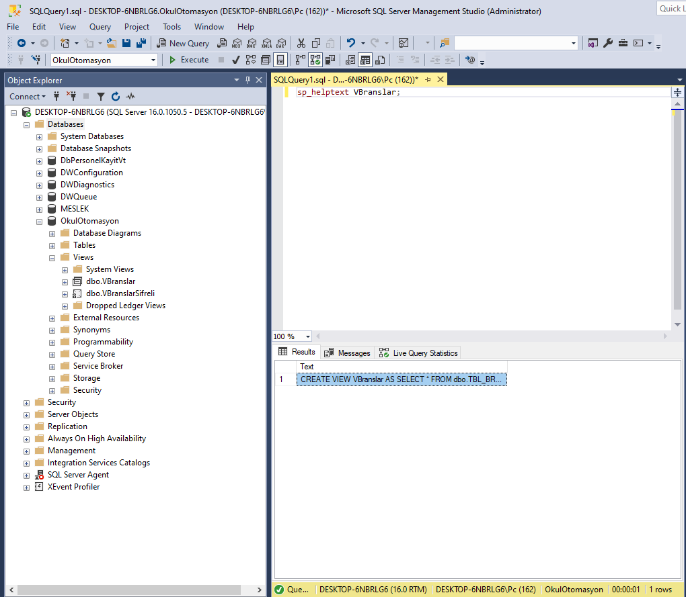

# View(Görünümler)
View gerçekte olmayan SELECT ifadesi ile oluşturulmuş sanal tablolardır.View bir veritabanına kaydedilen SELECT yapısına verilen isimdir.Yazılan her kod satırı,her nesne,her sorgu bir maliyet ve risktir.Hazırlanan kodda bir açık olduğunda riskler oluşacaktır.Eğer bir nesne oluşturulursa ve yeniden kullanılabilirliği sağlanırsa oluşabilecek hataların önüne geçilmiş olur.

Görünümler bir nesne içerisindeki ortak sorguları saklamayı ve sorguların tekrar kullanılabilmesini sağlayan kavramlardır.Sorguları tekrar yazmaktansa bir kez oluşturulan ve test edilmiş karmaşık sorgular herhangi bir risk içermediği sürece tekrar tekrar kullanılabilir.

Görünümler bir veya daha fazla tablodaki satır ve sütunların bir alt kümesinin oluşturulmasını sağlar Ayrıca kullanıcınıların erişebileceği  veriler üzerinde güvenlik mekanizması da oluşturulabiir.

## View oluşturmanın yararları
Tablo içerisinde bulunan her türlü bilgiye her kullanıcının erişmesini engellemek için kullanılabilir.Kullanıcının ihtiyaçlarına göre görünümler belirlenir ve böylece güvenlik önlemlerinin kullanımı için kolaylıklar sağlar.

İç içe select gibi karmaşık sorgularda yazım hatası yapılabilir özellikle de sürekli kullanılan bu şekilde ki ifadelerde hata yapma olasılığı yüksek olduğu gibi her defasında yazmak ek iş yükü getirecektir.Karmaşık sorgular VIEW kullanılarak daha basit hale getirilerek her defasında uzun ifadeler yazmak zahmetinden kurtulmuş olunur.

**Kullanım şekli**
```sql
CREATE VIEW view_adi AS select_ifadesi...
```
**örnek :**
```sql

CREATE VIEW PersonelMaas AS 
SELECT p.per_id AS "Personel No",
p.adsoyad AS "Adı Soyadı", 
pm.maas AS "Maaş" 
FROM personel p,personel_maas pm 
WHERE p.per_id=pm.per_id;

select * FROM PersonelMaas;
```


**Fonksiyonlar Kullanılan Select ifadesi için view tanımlama**
```sql
CREATE VIEW VKitaplarKategoriSayisi (KATEGORI_NO,ISBN) AS 
SELECT KATEGORI_NO AS "KATEGORİ", COUNT(ISBN) AS "SAYISI" 
FROM kitap_kategori GROUP BY KATEGORI_NO;

SELECT * FROM VKitaplarKategoriSayisi;
```

## View oluştururken SELECT ifadesinin kullanımı
- ORDER BY veya COMPUTE ifadelerini içeremez
- INTO anahtar sözcüğünü içeremez
- Geçici bir tabloyu referans olarak kullanamaz.

## WITH CHECK OPTION KULLANARAK VIEW TANIMLAMA
bir view üzerinden asıl tablolara kayıt eklemek pek önerilmesede mümkündür ancak SELECT sorgusunda kullanılan koşul ile eklenecek kayıt taki sütunlar uygun olmalıdır eğer koşul uygun ise view üzerinden asıl tabloya kayıt eklenebilir.

**DML İLE VIEW TANIMI**
```sql
CREATE VIEW per_list2 AS
SELECT * FROM personel WHERE maas<100 
WITH CHECK OPTION;
```
**INSERT İŞLEMİ**
```sql
INSERT INTO per_list2 VALUES("ALİ","KEREM",1400);
```
## VIEW'den VIEW ELDE ETMEK
Oluşturulmuş bir view üzerinden başka view ler oluşturulabilir bu oluşturulan view ler üzerinden ınsert update ve delete işlemleri gerçekleştirilebilir ancak view ler görüntülenirken uygun koşullardaki satırlar görüntülenir.

**VIEW 1**
```sql
CREATE VIEW view1 AS SELECT ad, soyad, telefon FROM personel WHERE telefon LIKE "50%"
```
**VIEW 2**
```sql
CREATE VIEW view1 AS SELECT ad, soyad, telefon FROM view1 WHERE ad LIKE '[A-K]%'
```
**VIEW 3**
```sql
CREATE VIEW view1 AS SELECT ad, soyad, telefon FROM view2 WHERE ad = 'Ayşe'
```

Eğer oluşturulan VIEW içerisinde bir fonksiyon veya hesaplama yapılıyorsa update,delete,insert işlemleri gerçekleştirilemez

DISTINCT ifadesi içeren viewler update,delete, insert işlemleri kullanılamaz.

WITH CHECK OPTION, içeren view için insert işlemi kullanılamaz.

Çoklu tablo içeren viewler için delete işlemi uygulanamaz.

View için kaynak oluşturan bir tabloda not null özelliği olan bir sütun var ise view için bu sütun kullanılmadığı takdirde insert işlemi kullanılamaz,Bu sütun view için kullanılırsa insert işlemi yapılırken değer girişi olmalıdır.

## VIEW İÇERİĞİNİN ŞİFRELENMESİ(VİEW ENCRYPTİON)
Veritabanı üzerinden oluşturulan view lerin oluşturulurken kullanılan sorgu cümleciği şirelenebilir şirelendiği takdirde decryption edilemez bu durumda view oluşturulurken kullanılan sql cümleciğinin yedeğini almak gerekir.

Bir view şifrelemek için aşağıdaki şekilde bir kullanım vardır.

```sql
CREATE VIEW view_adi WITH ENCRYPTION AS SELECT ...
```

Oluşturulmuş bir view yapısının oluştururken kullanılan sql cümleciği <code>sp_helptext view_adi</code> ile görülebilir ancak encrypt edilen view için bu gösterilmez.

<code>sp_helptext view_adi</code>: Bu komut ms sql server için geçerlidir ve viewler hakkında bilgi toplamak için kullanılabilir.

code>sp_help view_adi</code>:Bu komut view hakkında bazı bilgileri bir rapor halinde sunar.ms sql serverda geçerlidir.

**şifreli bir view**


**şifresiz bir view**


## VIEW İÇİN KULLANILAN TABLOLARIN SÜTUNLARINN KİLİTLENMESİ
Bir view oluşturulduktan sonra kaynak tablo sütunlarında değişiklik yapılmaması için **SCHEMABINDING** uygulanabilir böylece view silinmedikçe kaynak tablo sütunlarında alter işlemleri uygulanamaz

```sql
CREATE VIEW view_adi WITH SCHEMABINDING AS SELECT ...
```

## VIEW YAPISINI DEĞİŞTİRMEK (ALTER VIEW)
Daha önce oluşturulmuş bir view üzerinde değişiklik yapmak için **ALTER VIEW** ifadesi kullanılır.

```sql
ALTER VIEW view_adi(sütun_isimleri) AS SELECT ... 
```

**örnek 1**
```sql
CREATE VIEW per_list AS 
SELECT * FROM personel WHERE maas<1200
WITH CHECK OPTION
```
WITH CHECK OPTION kontrolünü kaldırmak istersek aşağıdaki gibi bir alter sorgusu yazmamız gerekir.

```sql
ALTER VIEW per_list AS 
SELECT * FROM personel WHERE maas<1200
```

## VIEWLERİN KALDIRILMASI
VIEW ler sadece yetkili bir kullanıcı tarafından silinebilir ve ona ait olan tüm tanımlar ortadan kalkar.

```sql
DROP VIEW view_ismi
```

## VIEW'lerin güvenliği(YETKİLER)
**tüm yetkileri kaldırmak**
```sql
REVOKE ALL ON view_adi ON kullanici
```

**tüm yetkileri vermek**
```sql
GRANT ALL ON view_adi ON kullanici
```