# Veritabanı Tasarımı
- **Tasarım yapılırken izlenecek adımlar**
    - Oluşturulacak sistemin nelerden oluşması gerektiği ve hangi işlemlerin hangi aşamada yapıldığı belirlenerek rapor tutulmalıdır.
    - Oluşturulan bu metne göre varlık ilişki modelinin oluşturulması
    - Varlık ilişki modelinin tablolara dönüştürülerek tabloların oluşturulması
    - Normalizasyon kurallarına uygun olmayan durumlarda tabloların bölünmesi 
    - ilişkilerin kurulması
    - Verilerin daha üst seviyede gösterilmesi 
    - KUllanılan model: ER (entity relationship- varlık ilişki)
    - Varlık ilişki modeli kavramsal tasarımda kullanılan popüler model
    - Vtys den bağımsız modelleme yapılır
    - Varlık ilişki modeinde kullanılan şekiller veritabanın şematik olarak tasarlanmasını sağlar
    - Temel üç öğe vardır.
        - **Varlık :**
            - Modelin en temel öğesi
            - Var olan ve benzerinde ayırt edilen herşey varlık;öğrenci,ders,kitap,araba
            - Birden fazla varlığın oluşturduğu kümeye varlık kümesi denir.
            - Model içerisinde dikdörtgen ile gösterilir.varlığın ismi içine yazılır.
            
        - **Nitelik :** 
            - varlıkların her bir özelliği nitelik olarak ifade edilir ogrNo,ad,soyad,dersKod,dersAd
            - Model içerisinde oval gösterilir.Niteliğin ismi içine yazılır.
            - Nitelik bulunduğu varlığa düz çizgi ile bağlanır
            - Varitabanında her tablonun bir sütununu ifade eder
            - Niteliğin değeri her bir varlık için farklıysa anahtar nitelik olarak belirlenir.Şema içerisinde altı çizilidir.
            - Birden fazla değere sahip nitelikler çok değerli niteliklerdir. ve çift çizgi ile gösterilir.
            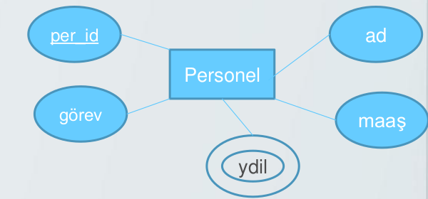
            - Domain(Etki alanı);Niteliğin alabileceği değer aralığıdır.Örneğin öğrenci notları 0-100 arasında olmalıdır.Etki alanı ER şemasında gösterilmez.
        - **ilişki :** Öğrenci.ogrNno <-- 1-n --> Notlar.ogrNo
            - Farklı varlık kümeleri arasındaki ilişkileri ifade eder.Öğrenci ve dersler arasında ders alma ilişkisi vardır.
            - Model içerisinde eğik dörtgen olarak gösterilir.ilişkinin ismi içerisine yazılır.
            - Baklava dilimi ilişkili olduğu varlıklara düz çizgi ile bağlanır.
            - Varlıklar arasında 1-1,1-n ve n-m ilişki olabilir
            - İki varlık kümesi arasında birden fazla ilişki olabilir.
            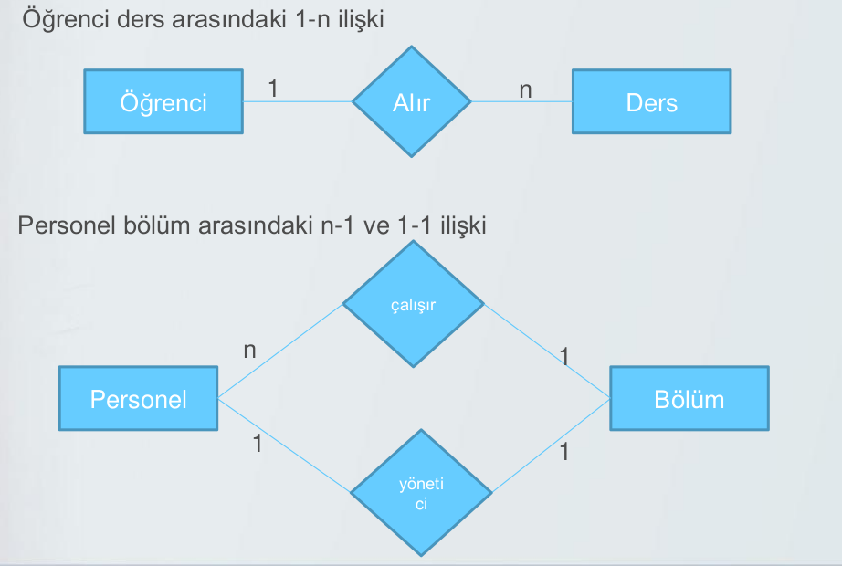
            - Varlık kümeleri arasında oluşturulan ilişlilerde ilişki sonucu nitelikler oluşabilir.bu niteliklere tanımlayıcı nitelik denir.Örnek;gösterime giren bir filmin sinemalarda gösterim saati ve tarihi farklıdır.
            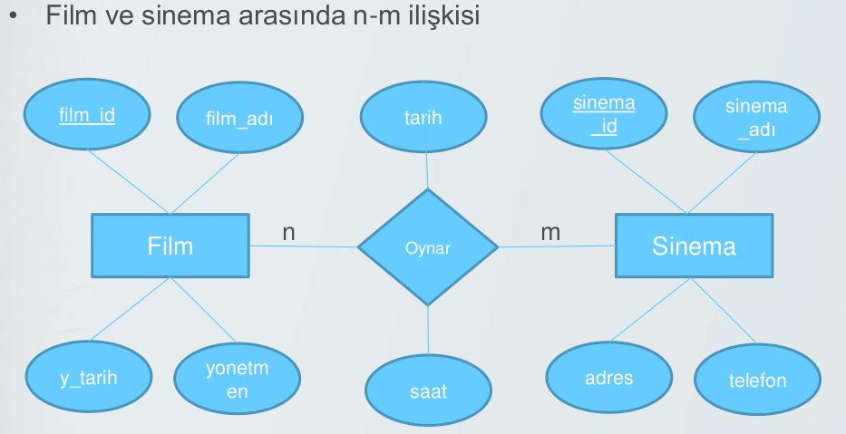
            - ilişkiler genelde farklı varlık kümelerinde olmasına rağmen bazen tek bir varlık kümesinde olabilir.Bu tür ilişkilere recursive ilişki denir.
            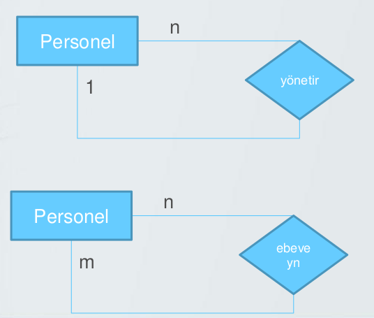
            - Bir varlık kümesi anahtar niteliğe sahip değilse zayıf varlık kümesi olarak adlandırılır.
            - Zayıf varlık kümeleri çift çizgili dörtgen ile gösterilir.
            
            - **Bire-bir ilişkilerin tabloya dönüşümü**
                - Varlık kümelerini tablolara dönüştür
                - Nitelikleri tabloların sütunlarına dönüştür.
                - İlişkide bir varlık kümesinnin birincil anahtarı diğer varlık kümesinin yabancı anahtarı olarak belirlenir.
                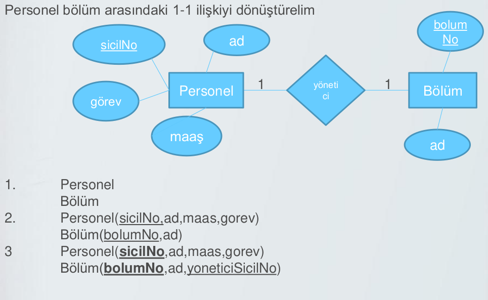
            - **Bire-cok ilişkilerin tabloya dönüşümü**
                - Varlık kümelerini tablolara dönüştür
                - Nitelikleri tabloların sütunlarına dönüştür
                - ilişkilerin n tarafındaki tabloya 1 tarafındaki tablonun birincil anahtar sütunu yabancıl anahtar olarak eklenir.
                - ilişkilerden tanımlayıcı nitelik bulunuyorsa tanımlayıcı nitelikler ilişkinin n tarafındaki tabloya sütun olarak eklenir.
                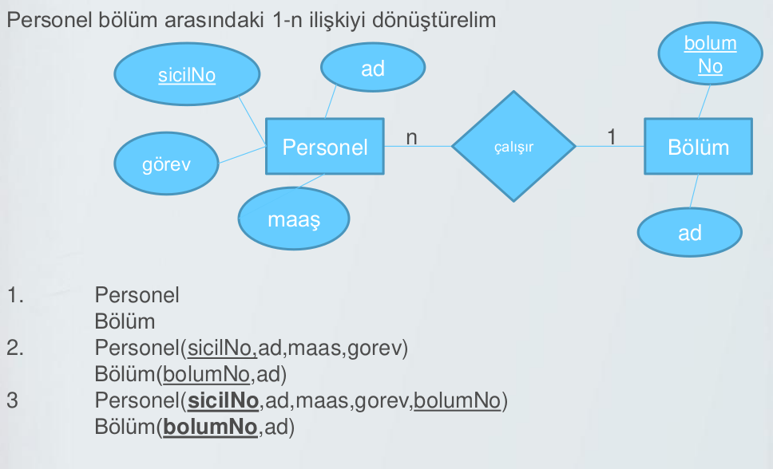
            - **Çoğa-çok ilişkilerin tabloya dönüşümü**
                - Varlık kümelerini tablolara dönüştür
                - Oluşturulan ilişki isminde tablo oluşturulur.
                - Nitelikleri tabloların sütunlarına dönüştür
                - İlişkiyi oluşturan tabloların birincil anahtarları ilişkiyi oluşturan tabloya yabancıl anahtar olarak eklenir.
                - İlişkide oluşturulan tablonun birincil anahtarı oluşturulan yabancıl anahtarların birleşiminden oluşur.Bu şekilde oluşturulan birincil anahtar cevap vermezse yeni bir alan eklenir ve birincil anahtar yapılır.
                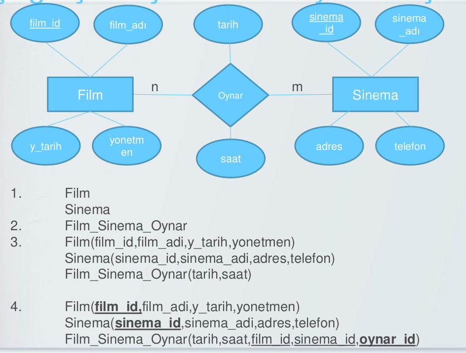
            - **Çok değerli niteliklerin tabloya dönüşümü**
                - Varlık kümeleri tablolara dönüşür
                - Nitelikleri tabloların sütunlarına dönüştür
                - Çok değer içeren nitelik için tablo oluştur.
                - Oluşan tabloya çok değerli niteliği ve bağlı bulunduğu varlığın birincil anahtarını yabancıl anahtar olarak ekle
                - Oluşan tablonun birincil anahtarı varlığın birincil anahtarı ve çok değerli niteliğin birleşiminden oluşmaktadır.
                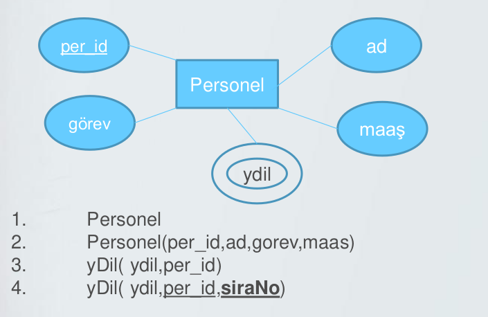

# Normalizasyon
**Normalizasyon;** veritabanı tasarım aşamasında veri tekrarını veri kaybını veya veri yetersizliğini önlemek için gerçekleştirilen işlemlerdir.
Normalizasyon tanım olarak ise;**(Ayrıştırma)**, veritabanlarında çok fazla sütun ve satırdan oluşan bir tabloyu tekrarlardan arındırmak için daha az satır ve sütun içeren alt kümelerine ayrıştırma işlemidir.Normalizasyon yapılırken uyulması gereken kuralların her birine normal form adı verilir.
- Birinci Normal Form (First Normal Form)
- İkinci Normal Form (Second Normal Form)
- üçüncü Normal Form (Third Normal Form)

ilk üç düzey ihlal edilirse;
- kayıt güncelleme,
- kayıt silme,
- kayıt bulmada zorluk çekilir.

3NF de olan tablolar 1NF ve 2NF ye uygundur.2NF olan tablolarda 1NF'YE uygundur.

- Veri bütünlüğünün sağlanması 
    - gereksiz veri tekrarını önlyerek verilerdeki bozulmaları önlemek
- Uygulamadan Bağımsızlık
    - Uygulama değişse bile veritabanı tutarlı olarak çalışmalı
- Performansı Artırmak
    - Veri tekrarı en aza iner ve arama hızlı olur.

## FONKSİYONEL BAĞIMLILIK
R ilişkisi X ve Y nitelik kümelerinden oluşmaktadır.Eğer X nitelik kümesininin değerleri Ynitelik kümesinin değerlerini belirliyorsa Yniteliği x niteiğine fonksiyonel olarak bağımlıdır. Ve durumlarda da fonksiyonel  bağımlıdır.ve X→Y şeklinde gösterilir.X in her bir değeri Y kümesininin bir değerine  karşılık deldiği durumlarda da fonksiyonel bağımlılık söz konusudur. Eğer x niteik kümesinden  bir nitelik çıkarıldığı halde bağımlılık devam eidyorda kismi bağımlılık söz konusudur.

**Örnek:** öğrencilere ait bölüm ve sınav bilgilerini  tutan bir tablo ogr_no,bolum_kodu,bolum_adi,ders_kodu ve sınav sütunlarından oluşmaktadır.aşağıda bu tabloya ait fonksiyonel bağımlılıklar gösterilmiştir.

OGRENCI(ogr_no,bolum_kodu,bolum_adi,ders_kodu ,sınav) bu tablo için her bir öğrenci aynı dersi bir kez alabileceği için ve veri takrarını önlemek için ogr_no ve ders_kodu için birleşik anahtar olarak tanımlanmıştır.
Bu tablo üzerindeki bağımlılıklar aşağıda verilmiştir.

Bolum ve bolum_kodu bilgilerinin oluşabilmesi için ogr_no tanımlanması gerekmektedir.bu nedenle ogr_no →bolum_kodu,bolum bağımlılığı vardır.

Bolum→ bolum_kodu bağımllılığı vardır.Bu bağımlılık anahtar sütuna bağımlı olmadığı için geçişli bağımlılıktır.

Sınav bilgisinin var olması öğrenci ve derse bağımlı olduğu için (ogr_no ders_kodu)→ sınav bağımlılığı vardır.

## 1NF
- Tekrarlanan sütun yapıları olmamalıdır.
- Birden fazla bilgi tek bir sütunda olamaz.
- Bir alan içerisindeki bilgi özel karakterlerle ayrılarak tutulmamalıdır.

|TELEFON TABLOSU||
|---|---|
|ADSOYAD|TELEFON|
|isim1 soyad1|1111,2222|
|isim1 soyad1|2222|
|isim2 soyad2|3333,4444|
|isim2 soyad2|4444|
|isim3 soyad3|5555|

|ADRES TABLOSU|||
|---|---|---|
|AD SOYAD|ADRES|
|isim1 soyad1|istanbul|bursa|
|isim1 soyad1|izmir||
|isim2 soyad2|ankara||

**1NF HALİNE GETİRDİKTEN SONRA**

|TELEFON TABLOSU|||
|---|---|---|
|AD|SOYAD|TELEFON|
|isim1|soyad1|1111|
|isim1|soyad1|2222|
|isim2|soyad2|3333|
|isim2|soyad2|4444|
|isim3|soyad3|5555|

|ADRES TABLOSU|||
|--|--|--|
|AD|SOYAD|ADRES|
|isim1|soyad1|istanbul|
|isim1|soyad1|izmir|
|isim2|soyad2|ankara|

**Ornek**
Aşağıdaki gibi bir tablo olsun
|isim|soyad|telefon|
|--|--|--|
|isim1|soyad1|1111|
|isim2|soyad2|2222|
|isim3|soyad3|3333|

bu tabloda bir kişinin telefon numarasınn güncellenmesi istendiğinde 
|isim|soyad|telefon|
|--|--|--|
|isim1|soyad1|1111|
|isim2|soyad2|2222|
|isim3|soyad3|3333|
|isim1|soyad1|1234|

şeklinde bir tablo yapısı olmuş olur burada veri tekrarı vardır. bu veri tekrarını önlemek için her bir kişi için bir no verilebilir ve telefon update sorugusu ile güncellenebilir.
|no|isim|soyad|telefon|
|--|--|--|--|
|1|isim1|soyad1|1234|
|2|isim2|soyad2|2222|
|3|isim3|soyad3|3333|

ancak bir kişi için iki farklı telefon numarası eklenmek isterse bu tablo yetersiz kalacaktır ve yeni bir sütun oluşturulacaktır.
|no|isim|soyad|telefon1|telefon2|
|--|--|--|--|--|
|1|isim1|soyad1|1234|1111|
|2|isim2|soyad2|2222||
|3|isim3|soyad3|3333||

bu şekilde telefon numarası eklenmiş olabilir ve kullanışlı olabilir ancak bu telefon2 verisine sahip olmayan kullanıcılar için de bir telefon2 sütunu eklemiş ve tabloda bulunan her kişi için bellekte içi boş yani null dahi olsa bir yer ayrıldığı anlamına gelir buda belleğin verimsiz kullanılmasına neden olur.Bu sorunu çözmek için aşağıdaki şekilde telefon tablosu oluşturulabilir ve kişiler tablosundan telefon sütunları kaldırılabilir.

|no|isim|soyad|
|--|--|--|
|1|isim1|soyad1|
|2|isim2|soyad2|
|3|isim3|soyad3|

|no|telefon|
|--|--|
|1|1111|
|2|2222|
|3|3333|
|1|1234|

**SORUNLAR** 
- Veri ekleme
    - Eklenen verinin daha önce olup olmadığının kontrolü zor
- Veri güncelleme
    - Kişiye ait bir telefon numarası güncellenmek istediğine hangisinin güncelleneceği
- Veri silme
    - Silinecek verinin hangisini olduğu

## 2NF
1NF de karşılaşılan sorunları çözmek için 2NF kuralına uygun olmalıdır.2NF nitelikler arasında fonksiyonel bağımlılıktan yararlanılarak tabloların birden fazla tabloya dönüştürülmesi ile sağlanır.
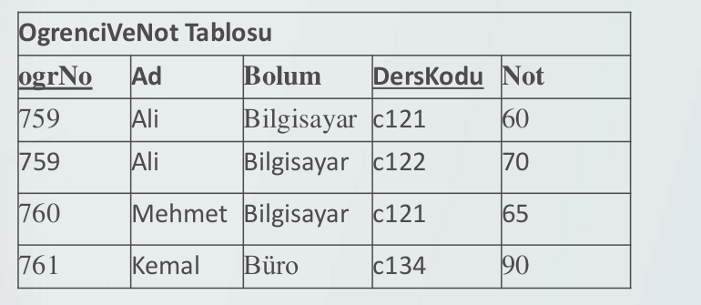
- Tabloda bir birincil anahtar olmalı ve anahtar olmayan sütunlar birincil anahtara bağımlı olmalı
- Birincil anahtar birden fazla sütundan oluşuyorsa tablodaki veriler her iki sütuna da bağımlı olmalıdır.

Öğrenci ve not tablosunda Ad,Bolum Sütunları gereksizdir
bunların başka tablolardan derkodu kullanılarak şekilmesi gerekir bu güncelleme sorunlarına yol açar bunun için tablonun bölünmesi gereklidir.

Tabloda anahtar sütun iki farklı sütun bilgisindeki verilerden oluşuyorsa diğer sütunlardaki verilerin bu iki sütunada bağlı olmalı gereklidir.
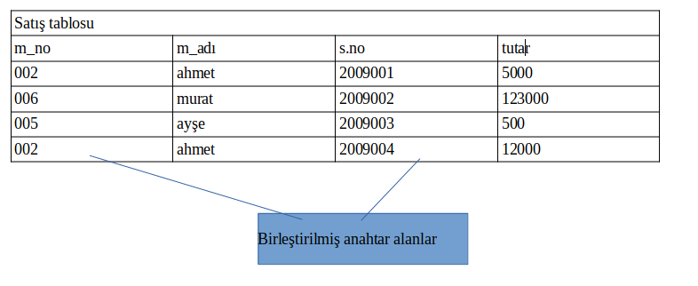

**Öğrenci tablosunun 2NF kuralına uygun hali**
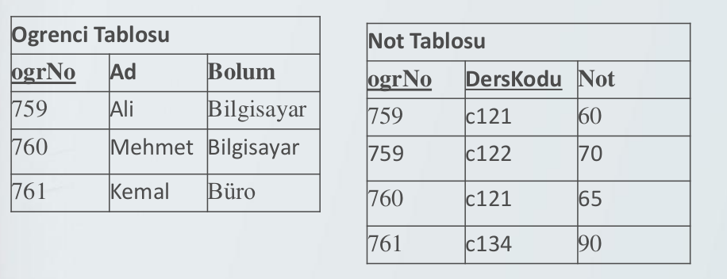
**Satış tablosunun 2NF kuralına uygun hali**
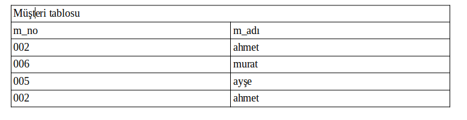
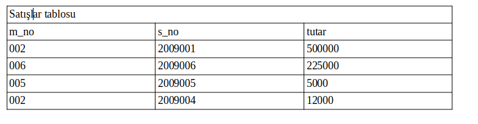

## 3NF
**2NF sorunları** 
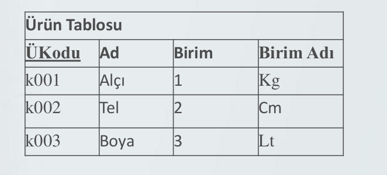
Anahtar olmayan sütunlar anahtar sütuna tam bağımlı olmalı.Anahtar olmayan sütuna bağımlı olmamalıdır.
2NF’de sadece anahtar olmayan bir sütun başka bir tablonun anahtar sütunu veya bulunduğu tablonun sütunlarıyla ilgili olmalıdır.
Veya bir tablo için anahtar  olmayan bir sütun anahtar olmayan başka hiçbir sütuna bağımlı olamaz ayrıca veritabanında ilişkiler 2NF kuralına uymalıdır.
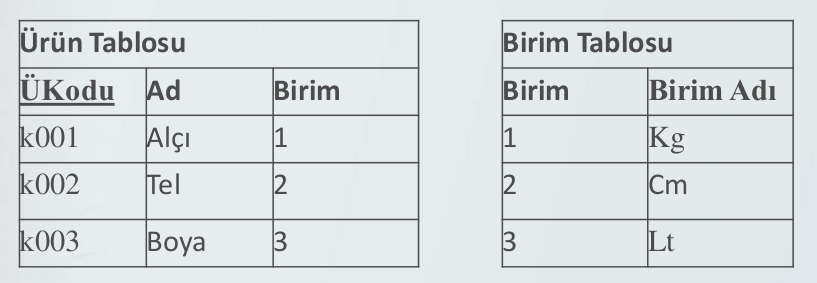

## ORNEKLER
|musterino|urunid|sehir|sehikodu|miktar|
|--|--|--|--|--|
|m123|u1|istanbul|1|100|
|m123|u2|istanbul|1|150|
|m152|u2|tokat|2|10|
|m126|u3|samsun|3|200|
|m128|u1|tokat|2|255|

bu tablo 1nf uygundur ancak 2nf uygun değildir.

|musterino|urunid|miktar|
|--|--|--|
|m123|u1|100|
|m123|u2|150|
|m152|u2|10|
|m126|u3|200|
|m128|u1|255|

|musterino|sehir|sehirkodu|
|--|--|--|
|m123|istanbul|1|
|m152|tokat|2|
|m126|samsun|3|
|m128|tokat|2|

bu tablo 2nf uygundur ancak 3nf için uygun değildir

|musterino|urunid|miktar|
|--|--|--|
|m123|u1|100|
|m123|u2|150|
|m152|u2|10|
|m126|u3|200|
|m128|u1|255|

|musterino|sehirkodu|
|--|--|
|m123|1|
|m152|2|
|m126|3|
|m128|2|

|sehirkodu|sehir|
|--|--|
|1|istanbul|
|2|tokat|
|3|samsun|

bu tablolar 3 nf kuralına uygundur.

## BOYCE CODD NORMAL FORM
Eğer bir tablo 3NF kuralına uygunsa ve her belirleyici aday anahtar ise tablo BCNF kuralına uygundur.Belirleyici bağımlılık işaretinin solundaki özellik veya özellikler grubudur.Örneğin a → b belirleyici A’dır.

BCNF kuralına uygun bir tablo 1NF , 2NF  ye de uygundur ama 3NF ye uygun olamaz.

|hastano|hastaismi|randevudurumu|saat|doktor|
|--|--|--|--|--|
|1|isim1|0|09.00|doktor1|
|2|isim2|0|09.00|doktor2|
|3|isim3|1|10.00|doktor1|
|4|isim4|0|13.00|doktor2|
|5|isim5|1|14.00|doktor1|

Yukarıda verilen tablo bir diyet uygulayan kliniğe aittir her hasta 4 aşamalı (0,1,2,3) bir tedaviden geçer 0 nolu randevu durumu saat 09:00 veya 13:00 de 1 nolu randevu saat 10:00 veya 14:00 dedir. 2 ve 3 nolu randevular da bu şekilde devam etmektedir.

Verilen bilgiler doğrultusunda bu tabloya ait fonksiyonel bağımlılıklar aşağıdaki gibidir.
- hasta_no → hasta_ismi
- hasta_no, randevu_durumu →saat,doktor
- saat  → randevu_durumu

verilen bağımlılıklara göre tablo için iki farklı primary key ekleneblir.bunlar;
- sonuç1:DB(hasta_no,hasta_ismi,randevu durumu,saat,doktor)

veya
- sonuç2:DB(hasta_no,hasta_ismi,randevu_durumu, saat, doktor)

1NF :uygun çünkü tekrar eden gruplar yok.
2NF :hasta isminin hasta_no ile bağımlıllığı vardır. Ama saat ile bağımlılığı yoktur.Randevu durumunun saat ile bağımlılığı vardır ama hasta_no ile bağımlılığı yoktur.bu nedenle hasta_ismi tablo yeni bir tabloda tutulduğunda ve randevu_durumu yeni bir tabloda tutulduğunda 2NF kuralına uygun hale getirilmiş olur.

- DB(hasta_no,saat,doktor)
- DB2(hasta_no,hasta_ismi)
- DB3(saat,randevu_durumu)

3NF :geçişli bağımlılıklar bulunmadığı için son durum 3NF kuralına uygundur.
BCNF:tüm belirleyiciler anahtar konumunda olduğu için BCNF ‘ye uygundur.
**Ornek**
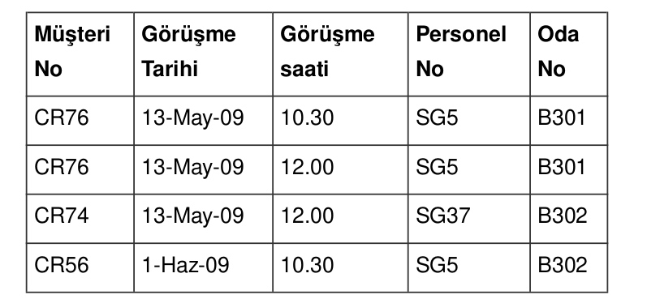
- FD1 “Müşteri No”, “Görüşme Tarihi” → “Görüşme Saati”,“Personel No”, “Oda No”(Birincil Anahtar, Primary Key)
- FD2 “Personel No”, “Görüşme Tarihi”, “Görüşme Saati” →“Müşteri No” (Adah Anahtar, Candidate key)
- FD3 “Oda No”, “Görüşme Tarihi”, “Görüşme Saati” →“Müşteri No”, “Personel No” (Aday Anahtar, Candidate key)
- FD4 “Personel No”, “Görüşme Tarihi” → “Oda No” (Aday anahtar DEĞILDIR)

Yukarıdaki fonksiyonel bağımlılıklardan 4.’sü bir aday anahtar değildir. Dolayısıyla veri bütünlüğü (data integrity) açısından sorun olabilir. Örneğin herhangi bir personel için oda değişikliği veri tabanından birden fazla değişikliğin kontrolünü gerekir.
Örneğin SG5 personeli, B301 odasındadır, bu personelin odasının değişmesi durumunda veri tabanında ya veri bütünlüğü sorunu olur ya da birden fazla erişim gerekir. Bu sorunun çözümü olarak BCNF şeklinde olan aşağıdaki iki tabloya bölünmesi gerekir:
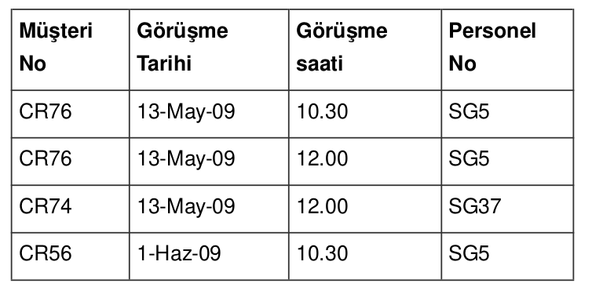
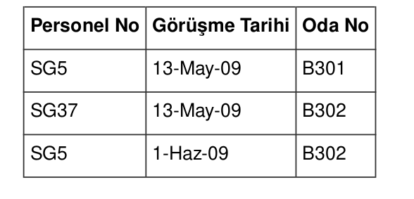