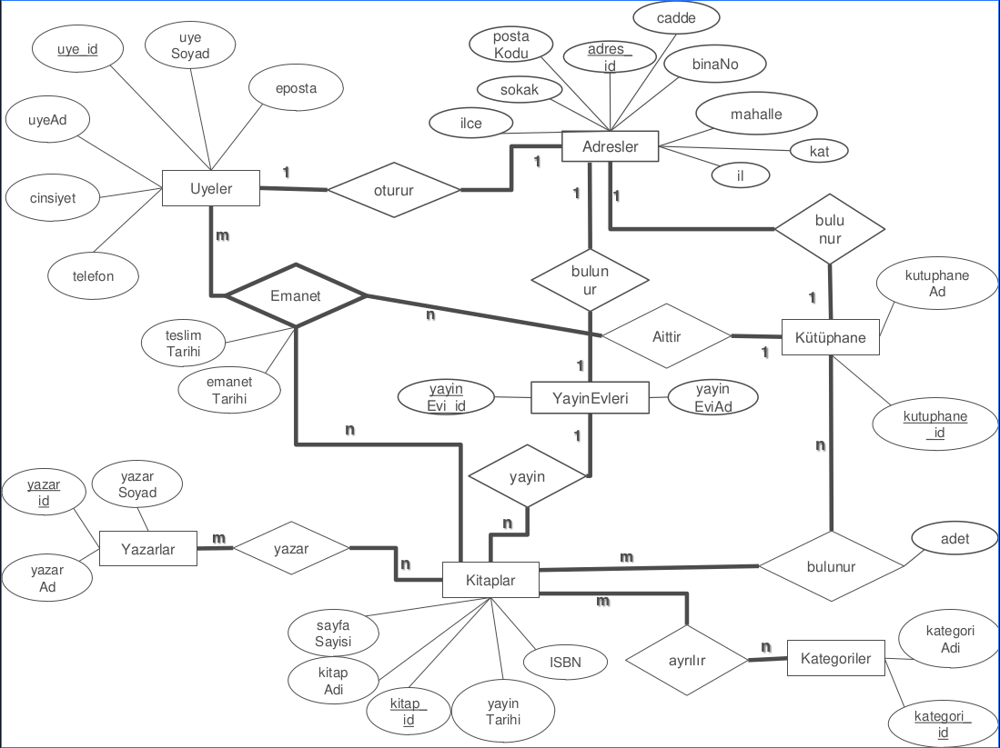
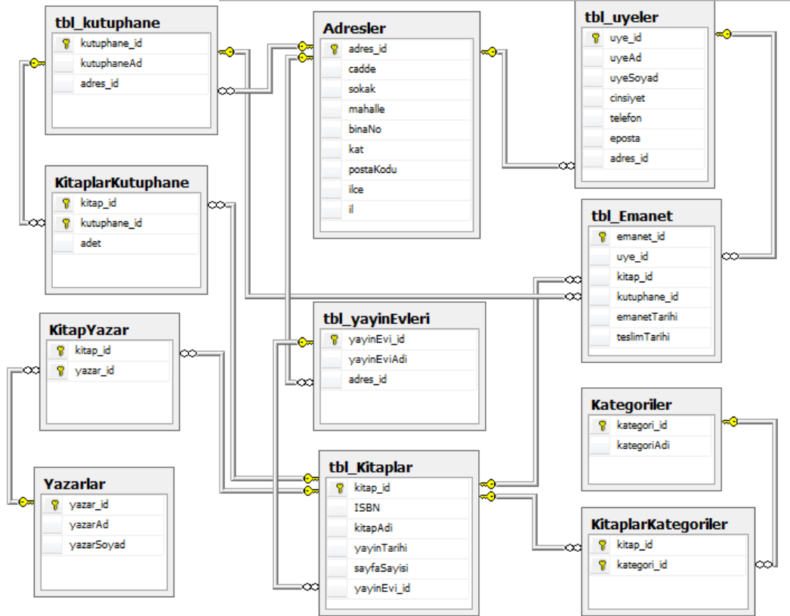
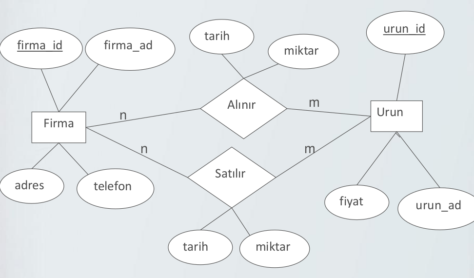
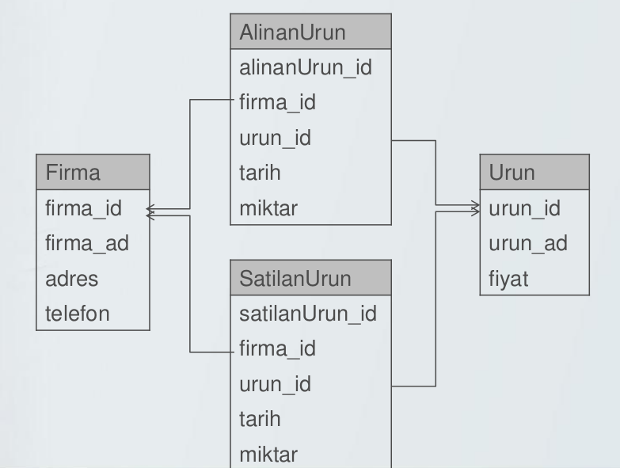
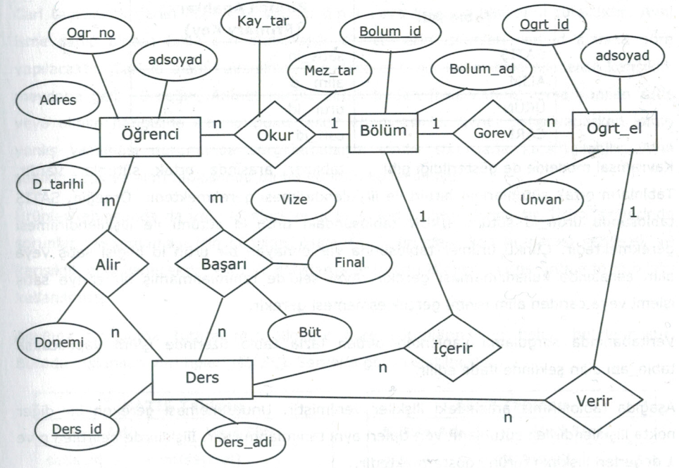
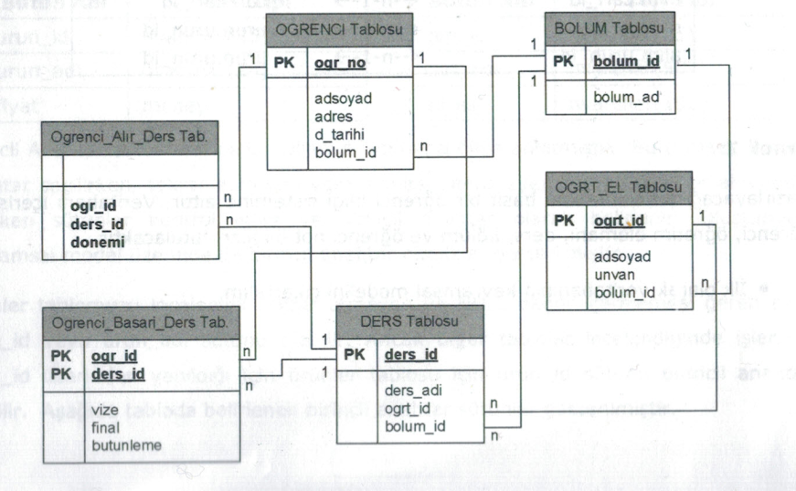
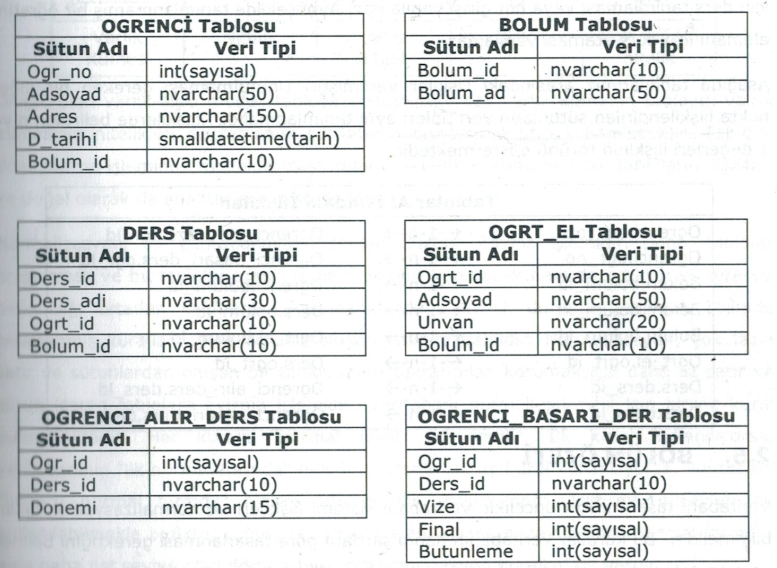

# Örnek Veritabanı Tasarımları
## Kütüphane
- Birden fazla kütüphane ve bu kütüphanelerde bulunan kitapların üyelere ödünç verilmesine dayanır
- Kütüphanelerin adres ve isimleri vardır.
- Kitapların ISBN numarası, adı, kategorisi, yayın tarihi,yayın evi ve yazarları, sayfa sayısı vardır.
- Yayın evlerinin ad ve adres bilgileri vardır.
- Yazarların ad, soyad bilgileri tutulmaktadır. Bir kitabın birden fazla yazarı olabilmektedir.
- Üyelerin tcNo, ad, soyad, telefon, adres ve e-posta bilgileri tutulmaktadır. Üyeler istedikleri kütüphaneden kitap alabilirler.
- Üyeler aldıkları kitapları belli sürede teslim etmeleri gerekmektedir.
- Kitapların kategorileri vardır. Bir kitap birden fazla kategoride bulunabilir.
- Kütüphane ve Üye adres bilgileri sisteme kayıt edilirken ; cadde, sokak, mahalle, bina No , şehir ve posta kodu gibi bilgiler kayıt edilecektir.
- Veritabanı içerisindeki nesnelerin gerçek hayattaki karşılığı.
    - Kutuphane
    - Kitaplar
    - Uyeler
    - Yazarlar
    - Yayınevleri
    - Kategoriler
- Varlıkları açıklamak için kullanılan özellikler.
    - Kutuphane
        - kutuphane_id, kutuphaneAd, adres
    - Kitaplar
        - kitap_id, ISBN, kitapAd, yayinTarihi,sayfaSayisi
    - Uyeler
        - uye_id,tcNo,ad,soyad,cinsiyet,telefon,eposta,adres
    - Yazarlar
        - yazar_id,yazarAd,yazarSoyad
    - YayinEvleri
        - yayinEvi_id, yayinEviAdi,adres
    - Kategoriler
        - kategoriNo, kategoriAdi
- Adres niteliği çok değerli niteliktir. Çok değerli
nitelik olduğundan ve 3 farklı tabloda tekrar
ettiğinden Adres niteliğini varlık olarak alalım.
    - Adresler
        - adres_id, cadde, sokak, mahalle, binaNo, kat , ilçe, il, postaKodu
- anahtar nitelikler
    - Kutuphane
        - kutuphane_id, kutuphaneAd
    - Kitaplar
        - kitap_id, ISBN, kitapAd, yayinTarihi, sayfaSayisi
    - Uyeler
        - uye_id,tcNo, ad, soyad, cinsiyet, telefon, eposta
    - Yazarlar
        - yazar_id, yazarAd, yazarSoyad
    - YayinEvleri
        - yayinEvi_id, yayinEviAdi
    - Kategoriler
        - kategori_id, kategoriAdi
    - Adresler
        - adres_id, cadde, sokak, mahalle, binaNo, kat , ilçe, il, postaKodu

### ER DİAGRAMI ve CONSTRAİNT

## Firma
- Hazırlayacağımız veritabanı bir şirketin
    - aldığı ve sattığı ürün bilgilerini
    - ürünleri hangi firmalardan ne zaman ve ne
    kadar alındığını
    - hangi firmalara ne zaman ve kadar sattığı
    bilgilerini tutacaktır.

## Ogrenci Bilgi Sistemi
Basit öğrenci bilgi sistemi ait bir veritabanı olacak.Öğrenci,Öğretim elemanı,ders,bölüm ve öğrenci not bilgileri tutulacak.

