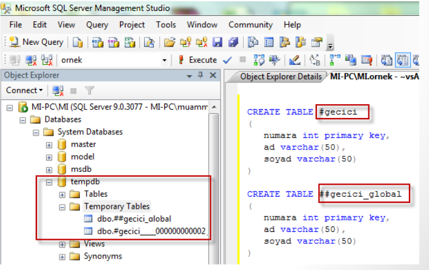

# MS SQL SERVER ORNEKLER
## TABLO OLUSTURMA IF EXISTS
```sql
IF EXISTS (SELECT 1 FROM sysobjects WHERE xtype='u' AND name='ornek')
DROP TABLE ornek;
GO
use ornekveritabani
GO
CREATE TABLE ornek(
    ad varchar(50),
    soyad varchar(50)
);
GO
```
burada yapılan öncelikle tablonun var olup olmadığının kontrolüdür burada **sysobjects** tablosunda **xtype** ve **name** koşuluna uyan bir satır olup olmadığı kontrol ediliyor.

```sql
SELECT .....    --
.....           -- BATCH
.....           --
UPDATE .....    --
GO
SELECT .....    --
.....           -- BATCH
.....           --
DELETE .....    --
GO
```
**GO**  deyimi BATCH içinde bir yazım hatası olduğunda batch çalışmaz hale gelir ve aynı batch içinde bir tablonun yapısı değiştirilip kullanılamaz.

**ÖRNEK**
```sql
CREATE DATABASE db_deneme
----
USE db_deneme
CREATE TABLE tbl_deneme3(asd NVARCHAR(50),def INT
IDENTITY(1,1) PRIMARY KEY,ghi NVARCHAR(50))
```
```sql
CREATE TABLE urun .........
INSERT urun ..........
GO
```
bu kodlar çalışmaz çünkü aynı batch içinde tablo değiştiriliyor ve veri girişi yapılmaya çalışılıyor.

```sql
CREATE TABLE urun .........
GO
INSERT urun ..........
GO
-- Buradaki kod ise hata vermeden çalışır.
```


- **sysobjects:** oluşturulan her nesne tablo,veritabanı,transaction vb herşey için veriler içeren bir tablodur. Sysobjects tablosu, SQL Server 2000 sistem tablosu olarak kullanılmıştır. Ancak, bu tablo geriye dönük uyumluluk için bir görünüm olarak dahil edilmiştir. Bu özellik gelecekteki bir sürümde kaldırılacağı için, bu tablo yerine sys.objects katalog görünümünü kullanılmalıdır.. Sys.objects katalog görünümü, sysobjects tablosuna benzer şekilde veritabanındaki nesnelerin bilgilerini içerir. Ancak, sys.objects katalog görünümünde type sütunu yerine type_desc sütunu kullanılır. Type_desc sütunu, nesne türünü açıklayan bir metindir. Örneğin, type_desc sütununun alabileceği değerler ve anlamları şöyle sıralanabilir:

    - AGGREGATE_FUNCTION
    - CHECK_CONSTRAINT
    - DEFAULT_CONSTRAINT
    - FOREIGN_KEY_CONSTRAINT
    - SQL_SCALAR_FUNCTION
    - CLR_SCALAR_FUNCTION
    - CLR_TABLE_VALUED_FUNCTION
    - SQL_INLINE_TABLE_VALUED_FUNCTION
    - INTERNAL_TABLE
    - SQL_STORED_PROCEDURE
    - CLR_STORED_PROCEDURE
    - PLAN_GUIDE
    - PRIMARY_KEY_CONSTRAINT
    - RULE
    - REPLICATION_FILTER_PROCEDURE
    - SYSTEM_TABLE
    - SYNONYM
    - SEQUENCE_OBJECT
    - SERVICE_QUEUE
    - CLR_TRIGGER
    - SQL_TABLE_VALUED_FUNCTION
    - SQL_TRIGGER
    - USER_TABLE
    - UNIQUE_CONSTRAINT
    - VIEW

- **xtype :** sütunu nesnenin türünü belirten bir karakterdir.  

    Xtype sütununun alabileceği değerler ve anlamları şöyle sıralanabilir
    | Xtype | Anlamı |
    |-------|--------|
    | AF | Aggregate function (CLR) |
    | C | CHECK constraint |
    | D | Default or DEFAULT constraint |
    | F | FOREIGN KEY constraint |
    | FN | SQL scalar function |
    | FS | Assembly (CLR) scalar-function |
    | FT | Assembly (CLR) table-valued function |
    | IF | SQL inline table-valued function |
    | IT | Internal table |
    | P | SQL Stored Procedure |
    | PC | Assembly (CLR) stored-procedure |
    | PG | Plan guide |
    | PK | PRIMARY KEY constraint |
    | R | Rule (old-style, stand-alone) |
    | RF | Replication-filter-procedure |
    | S | System base table |
    | SN | Synonym |
    | SO | Sequence object |
    | SQ | Service queue |
    | TA | Assembly (CLR) DML trigger |
    | TF | SQL table-valued-function |
    | TR | SQL DML trigger |
    | TT | Table type |
    | UQ | UNIQUE constraint |
    | V | View |
    | X | Extended stored procedure |


## TABLO OLUSTURMA VE AS DEYİMİ KULLANIMI
```sql
CREATE TABLE ornek(
    x INT,
    y INT,
    z as (x*y)/2;
);
```
yukarıdaki tablo ya veri girişi yapıldığında x ve y değleriyle ilgili işlemi yapar ve z sütunu için değeri belirler.
```sql
INSERT INTO ornek (x,y) VALUES (1,2);
```
tablo aşağıdaki gibi görünecektir.
|x|y|z|
|--|--|--|
|1|2|1|

## TABLO OLUŞTURMA VE DATEDIFF İLE CONSTRAINT TANIMLAMASI
```sql
CREATE TABLE satis
(
satisID int NOT NULL,
musteriID int NOT NULL,
sonodemetarihi smalldatetime NOT NULL,
CONSTRAINT kisit1 CHECK (DATEDIFF(day, satistarihi, sonodemetarihi ) <= 90)
)
```
**datediff:** (gun, ilk, son) → gun = ilk - son ; gün alarak farkı bulur satış tarihi ile son ödeme tarihi arasındaki fark en çok 90 gün olabilir
## TABLO OLUŞTURMA, TIMESTAMP-ROWVERSION

```sql
CREATE TABLE ExampleTable 
(PriKey int PRIMARY KEY,
timestamp);

CREATE TABLE ExampleTable2 
(PriKey int PRIMARY KEY,
VerCol rowversion);

insert into ExampleTable ( PriKey)VALUES(1)
insert into ExampleTable ( PriKey)VALUES(2)

insert into ExampleTable2 ( PriKey)VALUES(1)
insert into ExampleTable2 ( PriKey)VALUES(2)
```
- Timestamp ve rowversion komutlarını açıklamak isterim. Timestamp ve rowversion, birbirinin eş anlamlısıdır. Ancak, timestamp veri tipi kullanımdan kaldırılması planlanan bir veri tipidir. Bu yüzden, yeni geliştirme çalışmalarında timestamp yerine rowversion kullanılması tavsiye edilir. Rowversion, veritabanı içinde otomatik olarak oluşturulan ve her güncelleme veya ekleme işleminde artan benzersiz bir 8 baytlık ikili sayıdır. Rowversion, genellikle tablo satırlarının sürüm damgalanması için bir mekanizma olarak kullanılır. Rowversion veri tipi, bir tarih veya saat bilgisi saklamaz. Tarih veya saat kaydetmek için datetime2 veri tipini kullanmanız gerekir.

- Timestamp komutu, bir tabloya timestamp veri tipinde bir sütun ekler. Bu sütun için bir sütun adı belirtmeniz gerekmez. Örneğin, `CREATE TABLE ExampleTable1 (Prikey INT PRIMARY KEY, timestamp);` ifadesi, ExampleTable1 adlı bir tablo oluşturur ve bu tabloya Prikey ve timestamp adlı iki sütun ekler. Prikey sütunu INT veri tipinde ve PRIMARY KEY kısıtına sahiptir. Timestamp sütunu ise timestamp veri tipindedir ve sütun adı SQL Server Veritabanı Motoru tarafından otomatik olarak oluşturulur.

- Rowversion komutu da bir tabloya rowversion veri tipinde bir sütun ekler. Ancak, bu sütun için bir sütun adı belirtmeniz gerekir. Örneğin, `CREATE TABLE ExampLeTable2(Prikey INT PRIMARY KEY, VERCOL ROWVERSION);` ifadesi, ExampLeTable2 adlı bir tablo oluşturur ve bu tabloya Prikey ve VERCOL adlı iki sütun ekler. Prikey sütunu INT veri tipinde ve PRIMARY KEY kısıtına sahiptir. VERCOL sütunu ise rowversion veri tipindedir ve sütun adı bizim belirlediğimiz VERCOL'dür.

- Timestamp veya rowversion komutu ile oluşturulan sütunlar, her satırın benzersiz bir değere sahip olmasını sağlar. Bu değerler, veritabanındaki herhangi bir tablodaki herhangi bir satırın değerinden farklıdır. Bu değerler, satırın son güncelleme zamanını göstermez, ancak satırlar arasındaki göreceli zamanı izler. Bu özellik sayesinde, timestamp veya rowversion komutu ile oluşturulan sütunlar, optimistik eşzamanlama için kullanılabilir. Optimistik eşzamanlama, aynı anda birden fazla kullanıcının aynı verilere erişmesine izin veren bir yöntemdir. Bu yöntemde, kullanıcılar verileri okuduktan sonra güncellemek istediklerinde, timestamp veya rowversion değerleri karşılaştırılır. Eğer değerler aynı ise, güncelleme yapılır. Eğer değerler farklı ise, başka bir kullanıcının verileri değiştirdiği anlamına gelir ve güncelleme yapılmaz.

- Bir kullanıcı verileri okusun ve değiştirmek istesin değiştireceğinde veritabanına gönderilecek sorgu (okuma esnasında rowversion değerini alması gerekir) aşağıdaki gibi olacaktır.
```sql
UPDATE ExampleTable SET value = 2 WHERE PriKey = 1 AND VerCol = 0x000000000000007D4 
``` 
veritabanıda başka bir kişi bir sorgu güncellediğinde VerCol değeri otomatik olarak değişecektir ve bizim sorgumuzdaki koşul sağlanmadığı için veri güncellenemeyecektir.

## GECİCİ TABLOLAR
**#** ile başlayan tablolar geçici (temprorary) tablolardır.
- SQL server da geçici tablolar tempdb tabanı içerisinde oluşturulurlar.
- SQL Server a login olduğunuzda SQL Server sizin için bir oturum(Session) yaratır. Oluşturduğunuz geçici tablolar bu session da tutulur.
- SQL Server da açtığınız Session ı kapattığınızda geçici tablolarınızda yok edilir.
- “Local Temporary Table” lar sadece oluşturuldukları Session da kullanılabilir durumdadır.
- Eğer bir stored procedure geçici bir tablo oluşturuyor ise procedure sonlandığında tablo da yok edilir.
- Eğer birden çok session da kullanılmak üzere bir geçici tablo(Global Temporary Table) oluşturmak isterseniz aşağıdaki kodu kullanabilirsiniz. Bu tip tablolar bu tabloyu kullanan son Session kapandığında yani kullanıcı çıkış yaptığında yok edilirler.
- Temporary table ların farklı kullanıcılar tarafından aynı anda oluşturulma ihtimalleri vardır. Bu durumda sistem kendilerine unique(benzersiz) bir id ataması yaparak isim çakışmalarını engeller.

```sql
CREATE TABLE #gecici
(
numara int primary key,
ad varchar(50),
soyad varchar(50)
)

CREATE TABLE ##gecici_global
(
numara int primary key,
ad varchar(50),
soyad varchar(50)
)

```


## İLİŞKİSEL BİR SATIŞ TABLOSUNUN OLUŞTURULMASI
```sql
create table SATIS
(
musterino int FOREIGN KEY REFERENCES MUSTERI ON DELETE CASCADE ON UPDATE CASCADE,
urunno int FOREIGN KEY REFERENCES URUNLER ON DELETE CASCADE ON UPDATE CASCADE ,
satismiktari real,
satisfiyati money,
odenen money Default(0),
satistarihi DateTime Default(GetDate())
)
```
burada **ON DELETE CASCADE** ve **ON UPDATE CASCADE** deyimleri sorgunun alt tablolarda da belirtilen işlemlerde(silme ve güncelleme) etkinmesini sağlar.**GETDATE()** anlık zaman bilgisini döndürür.burada insert işlemi olduğunda herhangi bir tarih verisi girilmez ise o anda veritabanı sunucusnun zaman bilgisini alır.

## SELECT DEYİMİ LİSTELEME TOP N - TOP N PERCENT
```sql
SELECT TOP 2 * FROM kullanicilar;
```
İki adet kayıt listelenir

```sql
SELECT TOP 40 PERCENT * FROM kullanicilar;
```
Tüm kayıtların %40 ını listeler.
```sql
SELECT DISTINCT * FROM kullanicilar;
```
Tekrarlı kayıtlardan sadece bir tanesi listelenir.

```sql
SELECT * into stok_kopya FROM stok WHERE adet>=1
```
stok tablosunda adet değeri 1 den fazla olan kayıtların bir kopyasını stok_kopya tablosuna atar yeni bir kopya tablo oluşmuş olur.

```sql
SELECT (DATEADD(DAY,20,GETDATE()));
```
- `DATEADD(DATEPART,NUMBER,DATE)` :
    - **date :** üzerine ekleme yapılacak zamandır.
    - **datepart :** üzerine ekleme yapılacak gün,yıl vb zaman cinsidir.
    - **number :** ekleme yapılacak miktardır.

Yukarıdaki sorgu getdate() fonksiyonu ile  zaman bilgisini alıp dateadd() fonksiyonu bu bilginin üzerine gün cinsinden 20 miktarlık ekleme yapar, yani şu anki zamandan 20 gün sonrasının tarhini verir.

Aşağıda datepart örnekleri yer almakta;


## DECLARE İLE BASİT DEĞİŞKEN TANIMLAMAK
```sql
DECLARE @simdi DATETIME SET @simdi='2020-06-11';
SELECT @simdi;
```
`DECLARE` ile  DATETIME tipinde bir değişken tanımladık ve bu değişkene bir tarih değeri verdik daha sonra bu değişkeni select sorgusu ile görüntüledik.

```sql
DECLARE @haftayasimdi DATETIME SET @haftayasimdi=DATEADD(DAY,7,@simdi);
SELECT @haftayasimdi;
```
`@simdi` değişkeni üzerinden yeni bir tarih belirledik ve `@haftayasimdi` değişkenine atadık.

```sql
PRINT 'merhaba dünya'
PRINT @@error -- sql deyimi hata vermeden çalışırsa 0 eğer hata verirse değeri sıfırdan farklı bir değer olur
PRINT @@rowcount -- update, delete yada herhanbi insert deyimi çalıştığında haç tane kaydın eklendiğinin sayısını tutar.
```