# İLİŞKİSEL CEBİR
ilişkisel cebir ilişkisel veritabanları üzerinde yapılan sorgulama işlemlerini matematiksel olarak modellenmesi ve matematiksel işlemler ile çözülmesi için kullnılır.İlişkisel cebir ilişkisel model ile birlikte kullanılan veritabanı sorgulama dilidir ancak sorgulamalar teorik olarak gerçekleştirilir.Sql'den farklı olarak herhanbi yorumlayıcı veya derleyiciye gerek yoktur.Sorgular çeşitli operatörlerin birleşiminden meydana gelir.Sorguların temel özelliği ilişkisel bir veya iki ilişkiyi parametre olarak alıp sonuç olarak yine ilişki üretir.

Veritabanı yönetim sistemi yazılan ifadeleri veritabanına uygulamadan önce ilişkisel cebir işlemine çevirmektedir.
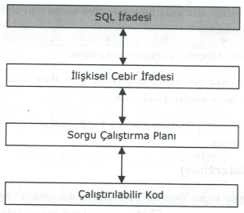

ilişkisel cebir temel opertörleri olan seçim(selection),atma(projection),kartezyen çarpım(cross-product),birleşim(union) ve küme farkı(set-difference) yani sıra kesişim(intersection) olmak üzere bazı ek operatörlerden oluşur.

ilişkisel cebir'de her operatör geriye bir ilişki döndürdüğüne göre birden fazla operatör aynı sorguda kullanılabilir.

**örnek:**  
`öğrenci(ogr_no,ogr_adi,bolum)`
`ders(ders_id,ders_adi)`
`notlar(ogr_no,ders_id,sinav1,sinav2)`

Burada **ogr_no** ve **ders_id** primary keydir.

## SEÇME
Bir ilişkiden belirlenen seçim kriterine göre satırlar içerisinden istenilenlerin seçilerek gösterilmesi işlemi gerçekleştirilir.
Seçim kriteri yazılırken tüm programlama dillerinde ve sql'de kullanılan karşılaştırma operatörleri(=,<,>,≤,≥,≠) kullanılır.ve mantıksal operatörüyle bağlanacaksa  ve için ⋀  veya için ⋁ kullanılır.

<code>σseçim_kriteri (TABLO)</code>

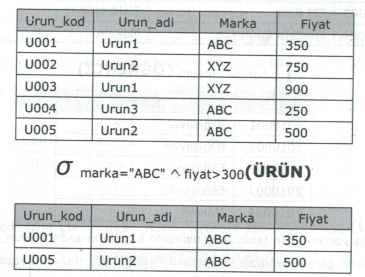

## Atma(Projection)
İstenmeyen sütunları gizlemek için kullanılır.Seçim işlemi ile birlikte de kullanılabilir.
<code>∏sütun_isimleri(TABLO)</code>

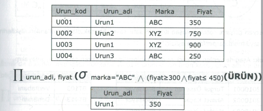

## Kartezyen Çarpım(Cross-Product)
iki ilişkiden elde edilecek tüm çiftlerin tek bir ilişki şeklinde gösterilmesidir.Örneğin öğrenci ve ders tablosundan elde edilecek tüm çiftlerin elde edilmesi,Kartezyen çarpımı sonucu elde edilen ilşki olarak kullanılan ilişkilerin sütunlarının tamamı barındıracaktır.

Kartezyen çarpım **X** simgesi ile gösterilir ve aşağıdaki şekilde kullanılır.
TABLO1 **X** TABLO2

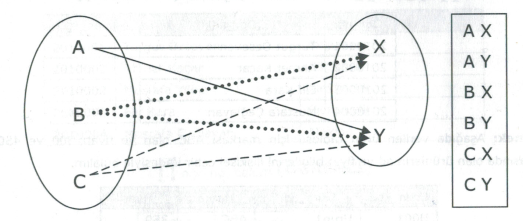

**örnek** 
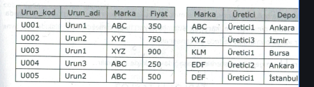

<code>σmarka.depo="Ankara" (URUN X MARKA)</code>

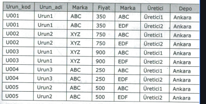

## Birleşim (Union)
iki ilişkide bulunan tüm satırları almak için kullanılır.Belirtilen iki ilişkide aynı sayıda sütuna ve sahip olmalıdır. ve karşılıklı sütunlar aynı tipde olmalıdır.İki ilişkidede aynı satırlar varsa bunlardansadece bir tanesi alınır.

<code>TABLO1 ⋃ TABLO2</code>

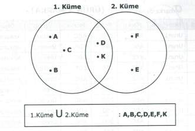
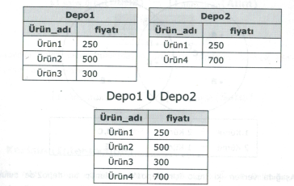
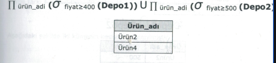

## Küme Farkı(Set-difference)
İki ilişkiden birinde bulunup diğerinde bulunmayan satırları bulmak için kullanılır.Belitilen iki ilişkide aynı sayıda sütuna sahip olmalıdır ve karşılıklı sütunlar aynı tipte olmalıdır.

`TABLO1 − TABLO2`
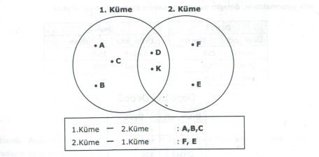
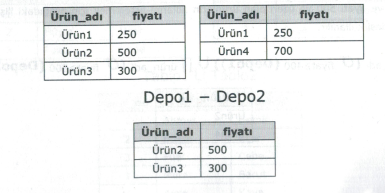
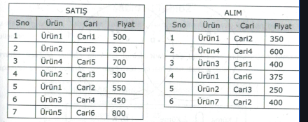
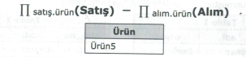
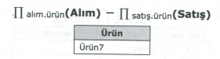

## Kesişim (Intersection)
iki ilişkiden her ikisinde de bulunan satırları almak için kullanılır.Belirtilen iki ilişki aynı sayıda sütuna sahip olmalıdır. ve karşılıklı sütunlar aynı tipde olmalıdır.

`TABLO1 ⋂ TABLO2`

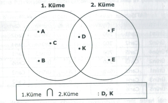
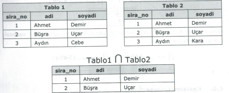
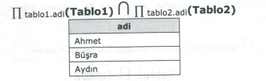

## Bölme (Division)
Elde edilen iki ilişkiyi karşılaştırarak birinci ilişkide ikinci ilişkinin tüm elemanlarını kapsayan satırları bulmak için kullanılır.

`TABLO1 : TABLO2`
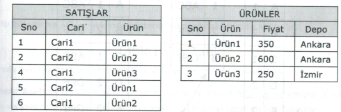
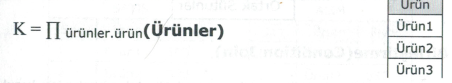
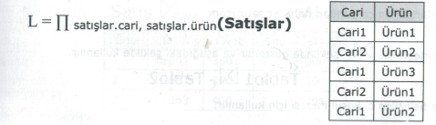
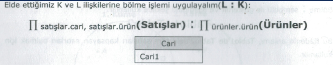

## Birleştirme (Join)
Ortak sütunlara sahip ilişkilerin birleştirilerek tek bir ilişkiye dönüştürülmesine birleştirme denir.Birleştirilecek ilişkilerin ortak sütunlara sahip olması gerekir.Tablolarda bulunan ortak anahtar sütunlar birleştirmenin temelini oluşturmaktadır.
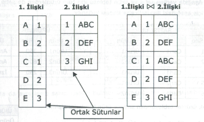

## Şartlı Birleştirme(Condition Join)
Şartlı birleştirmede, birleştirilen ilişkiler arasındaki ortak sütunlar için koşul ifadesi belirtilir.Elde edilen sonuç ilişkisi Kartezyen çarpıma benzer ama koşul ifadesinden dolayı kartezyen çarpımdan daha az satır içerir.

<code>TABLO1 ⋈C TABLO2</code>

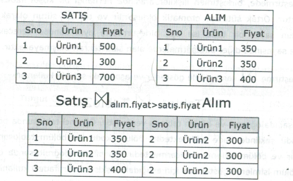

## Eşit Birleştirme(Equijoin)
Eşit birleştirmede birleştirilen ilişkiler arasındaki ortak sütunlar için eşitlik ifadesi belirtilir.Elde edilen sonuç ilişkisi Kartezyen çarpıma benzer ama ortak sütunlardan sadece bir tanesi vardır.

<code>TABLO1 ⋈e TABLO2</code>

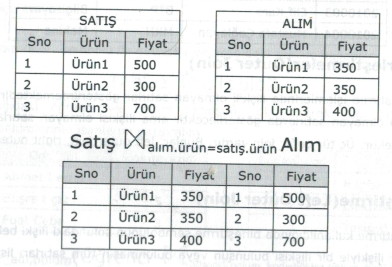

## Doğal Birleştirme(Natural Join)
Doğal birleştirmede, birleştirilen ilişkiler arasındaki herhangi bir koşul ifadesi yazmaya gerek yoktur.Ortak sütunlar otomatik birleştirilir. ve tek bir sütun olarak gösterilir.

<code>TABLO1 ⋈ TABLO2</code>

|Ogr_no|Ogr_adi|Bolum_kod|
|--|--|--|
|1|ali|btp|
|2|veli|elk|
|3|ayşe|elkt|
|4|fatma|btp|
|5|erkan|mkn|

|Bolum_kod|bolum|
|--|--|
|btp|bilgisayar|
|elk|elektrik|
|elkt|elektronik|
|mkn|makine|

<code>Ogrenci ⋈ Bolum </code>
|Ogr_no|Ogr_adi|Bolum_kod|Bolum|
|--|--|--|--|
|1|ali|btp|bilgisayar|
|2|veli|elk|elektrik|
|3|ayşe|elkt|elektronik|
|4|fatma|btp|bilgisayar|
|5|erkan|mkn|makine|

## Dışsal Birleştirmeler(Outher Join)
Normal birleştirme işlemlerinde ilişkili olmayan satırlar gösterilmemektedir.Outher join de ise ilişkili olmayan satırlarda gösterilecektir.ama ilişkisi olmayan satırlar için Null değer içerecektir.Üç outer join vardır,left outher join,right outer join ve full auter join

### Sol birleştirme (left outer join)
Bu tür birleştirme kullanıldığında birleştirme sembolünün solundaki ilişki belirleyicidir ve bunun diğer ilişkiyle ilişkisi bulunsun yada bulunmasın  tüm satırlar listelenir.
`TABLO1 ⟕ TABLO2`;

|Ogr_no|Ogr_adi|Bolum_kod|
|--|--|--|
|1|ali|btp|
|2|veli|elk|
|3|ayşe|elkt|
|4|fatma|DDD|
|5|erkan|mkn|

|Bolum_kod|bolum|
|--|--|
|btp|bilgisayar|
|elk|elektrik|
|elkt|elektronik|
|mkn|makine|

<code>∏ ogr_no,ogr_adi,bolum(ÖĞRENCİ ⟕ ogrenci.bolum_kod=bolum.bolum_kod BOLUM)</code>
|Ogr_no|Ogr_adi|Bolum|
|--|--|--|
|1|ali|bilgisayar|
|2|veli|elektrik|
|3|ayşe|elektronik|
|4|fatma|NULL|
|5|erkan|makine|

### Sağ birleştirme (Right Outer Join)
Bu tür birleştirme kullanıldığında birleştirme sembolünün sağındaki ilişki belirleyicidir ve bunun diğer ilişkiyle bir ilişkisi bulunsun ve bulunmasın tüm satırları listeyelecektir.Solunda ise sadece ilişkili satırlar listelenecektir.

`TABLO1 ⟖ TABLO2`

|Ogr_no|Ogr_adi|Bolum_kod|
|--|--|--|
|1|ali|btp|
|2|veli|elk|
|3|ayşe|elkt|
|4|fatma|btp|
|5|erkan|mkn|

|Bolum_kod|bolum|
|--|--|
|btp|bilgisayar|
|elk|elektrik|
|elkt|elektronik|
|mkn|makine|
|tst|tesisat|

<code>∏ ogr_no,ogr_adi,bolum(ÖĞRENCİ ⟖ ogrenci.bolum_kod=bolum.bolum_kod BOLUM)</code>
|Ogr_no|Ogr_adi|Bolum|
|--|--|--|
|1|ali|bilgisayar|
|2|veli|elektrik|
|3|ayşe|elektronik|
|4|fatma|btp|
|5|erkan|makine|
|NULL|NULL|tesisat|

### Full outer join 
Left outer join ve right outer join işleminin birleşim kümesidir.Yani her iki ilişkidede tüm satırlar listelenecek ve ilişkisi olamayanlar null değer içerecektir.
`TABLO1 ⟗ TABLO2`

### Yarı Birleştirme(Semi-join)
Semi-join doğal birleştirmeye benzer şekilde çalışır.Farklı olarak sadece belirtilen ilişkilerden bir tanesinin sütun bilgilerini içeriri diğer ilişkinin sütun bilgilerini içermez.Yani sadece bir tablodaki sütun bilgileri listelenir join edilen diğer tablodaki satırlar ve sütun bilgileri listelenmez.

`TABLO1 ⋉ TABLO2`

### Anti-Join
Anti-Join semi-join gibi ilişkilerden birisinde bulunan sütunları ama işlev olarak tam tersidir.ilişki arasında bağ bulunmayan satılar gösterilir.
`TABLO1 ᐅ TABLO2`
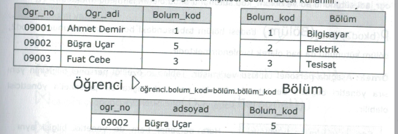

## Yeniden Adlandırma (Renaming)
Yeniden adlandırma, ilişkiler veya ilişkilerin içerdiği sütunlara takma isim vermek için kullanılır.Birleştirme veya kartezyen sonucu elde edilen aynı isimli sütunların isimlri karşıklığı önlemek için değiştirilebilir veya ilişkisel cebir sonucu elde edilen tabloya isim verilebilir.`ρ` ile gösterilir.

<code>ρs(b1,b2,...bn)(R)</code> şeklinde kullanım R ilişkisi için S ismini,sütunlar için de b1,b2,...,bn isimlerini verecektir.

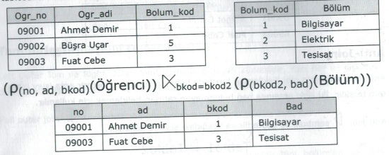

## Özetleme ve Gruplama
Özetleme işlemi bir tablo içeriğinin bir sütuna göre hesaplamalar yapılmasını içerir.Gruplama da özetlemeye çok benzer ama aralarında fark vardır,Gruplama,tablonun içeriğini istenilen bir sütun içeriğine göre gruplandırarak her bir grup için hesaplamalar yapılmasını sağlar.Örneğin A departmanındaki personellerin ortalama maaş bilgisini almak gibi işlemler de gruplandırarak özetleme olarak ifade edilir.Bu işlemler max,min,average,count,sum gibi fonksiyonlar ile yapılır.

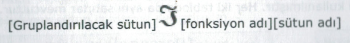

|Ogr_no|Ogr_adi|yonetici|maas|
|--|--|--|--|
|1|ali|null|1500|
|2|veli|3|1000|
|3|ayşe|1|1100|
|4|fatma|3|900|
|5|erkan|1|1000|

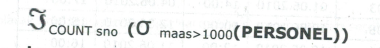

## Semboller
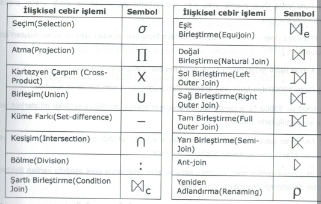