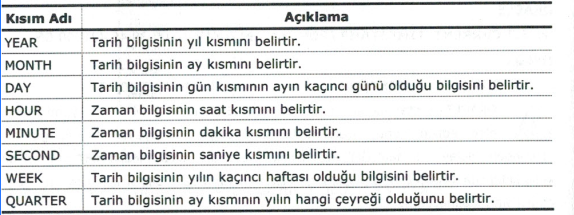

# FONKSİYONLAR
## Karakter Kümesi Fonksiyonları
### CONCAT()
Kendisine gelen değerleri birleştirmek için kullanılır.
```sql
SELECT  CONCAT(sutun1, ' ', sutun2) AS "ADSOYAD" FROM tablo;
```
### SUBSTRING()
Verilen karakter kümesindeki karakterlerin bir kısmını almak için kullanılır.
```sql
SELECT SUBSTRING(veri_kümesi_sutun,karakter_başlangıç,karakter_sayisi) FROM tablo;
```
### LEFT(), RIGHT() 
Verilen karakter kümesinin sağından yada solundan belirli karakter sayısına göre karakterlerin alınmasını sağlar.ikisinin kullanımıda aynıdır.
```sql
SELECT LEFT(sutun,karakter sayisi) FROM tablo;
```
### LOWER(),UPPER()
LOWER() verilen değer içindeki harfleri küçük,UPPER() ise büyük harfe çevirir.
```sql
SELECT UPPER(sutun) FROM tablo;
```
### TRIM(),LTRIM(),RTRIM()
Bu fonksiyonlar kendisine gelen değer içindeki boşlukları kaldırır.TRIM() her iki taraftaki boşlukları kaldırır,LTRIM() soldaki boşlukları kaldırır,RTRIM() sağdaki boşlukları kaldırır. 
```sql
SELECT LTRIM(sutun) FROM tablo;
```
### INITCAP()
Oracle veritabanlarında kullanılan bir fonksiyondur ve içerisine parametre olarak verilen veri kümesinin içindeki kelimelerin ilk harfini büyük harf yapar.
```sql
SELECT INITCAP(sutun) FROM DUAL;
```

#### (LEADING | TRAILING) Kullanımı
LEADING VE TRAILING özel bir kullanımdır ve mysql ile oracle veritabanlarında kullanılabilir.
**LEADING** : TRIM fonksiyonu LEADING ile kullanıldığında veri kümesinin  ön tarafında bulunan boşlukları veya istenilen karakteri siler.
**TRAILING** : TRIM fonksiyonu ile TRAILING kullanıldığında karakter kümesinin sonunda bulunan boşlukları ve istenilen karakteri siler.

**ORACLE**
```sql
SELECT '<' || TRIM(LEADING FROM ' deneme ') || '>' FROM DUAL
```
**mysql**
```sql
SELECT CONCAT('<',TRIM(LEADING FROM )  ' deneme ')
```

### LEN(),LENGTH()
Bir veri kümesindeki karakter sayısını bulmak için kullanılır. LEN() ORACLE içindir,LENGTH() mysql ve ms sql içindir.
```sql
SELECT LENGTH(sutun) FROM tablo;
```
### REPLACE()
Bir veri kümesindeki bir kısmı istenilen başka bir veri ile değiştirmek için kullanılır.
```sql
SELECT REPLACE(sutun,eski_veri,yeni_veri) FROM TABLO;
```
### CHARINDEX(), INSTR()
Bir karakter kümesi içerisindeki başka bir karakter kümesini aramak içn kullanılır.Aranan bilgi bulunursa index numarası geri döner eğer bulunmassa 0 döner.

**mysql**
```sql
SELECT CHARINDEX(aranacak_bilgi,arama_yeri,arama_başlangıç_noktasi) FROM tablo;
```
**oracle ve mssql**
```sql
SELECT INSTR(arama_yeri,aranacak_bilgi) FROM DUAL;
```
### REVERSE()
Bir veri kümesinin tersten sıralar
```sql
SELECT REVERSE(sutun) FROM tablo;
```
### ABS()
Mutlak değer alır.
```sql
SELECT ABS(sutun) FROM tablo;
```
### FLOOR(), CEIL(), CEILING()
CEIL() ve CEILING() aldığı değeri yukarı yuvarlar.CEIL() hem mysql hemde oracle veritabanlarında kullanılabilir ancak CEILING() sadece mssql ver mysql veritabanlarında kullanılabilir.

**CEIL()**
```sql
SELECT CEIL(sutun) FROM tablo;
```
**CEILING()**
```sql
SELECT CEILING(sutun) FROM tablo;
```
FLOOR() sayıyı aşağı yuvarlamak için kullanılır.
```sql
SELECT FLOOT(sutun) FROM tablo;
```

### ROUND()
Verilen sayıyı en yakın tam sayıya yuvarlar.
```sql
SELECT ROUND(sutun) FROM tablo;
```
### POWER()
Verilen sayının üsstünü alır.
```sql
SELECT POWER(sutun,üs) FROM tablo;
```
### SQRT()
Verilen sayının kökünü alır.
```sql
SELECT sqrt(sutun) FROM tablo;
```
### SUM()
Bir sütun için toplam almakta kullanılır.
Verilen sayının üsstünü alır.
```sql
SELECT SUM(sutun) FROM tablo;
```
### AVG()
Bir sütun için ortalama almakta kullanılır.
Verilen sayının üsstünü alır.
```sql
SELECT AVG(sutun) FROM tablo;
```
### MAX(), MIN()
Bir sütun için maksimum ve minimum değerleri almak için kullanılırlar.
Verilen sayının üsstünü alır.

**maksimum değer**
```sql
SELECT MAX(sutun) FROM tablo;
```
**minimum değer**
```sql
SELECT MIN(sutun) FROM tablo;
```
### COUNT()
Verilen sutundaki satır sayısını bulmak için kullanılır.
```sql
SELECT MIN(sutun) FROM tablo;
```
### DISTINCT()
Verilen sutundaki benzersiz satırları listelemek için kullanılır.
```sql
SELECT DISTINCT(sutun) FROM tablo;
```
### MOD(), %
Belirlenen sütundaki sayının modunu almak için kullanılır mod işlemi desteklenmiyorsa % işareti ile işlem tanımlanarak sütundaki mod bulunabilir.

```sql
x % Y veya MOD(x,y)
```
### CURRENT_TIMESTAMP
Güncel zaman bilgisini alır.
```sql
SELECT CURRENT_TIMESTAMP; 
```
Sistemin zaman bilgisi aşağıdaki şekilde alınabilir.
**MS SQL**
```sql
SELECT GETDATE(); -- 2010-09-23 12:22:33.432
```
**ORACLE**
```sql
SELECT SYSTIMESTAMP FROM DUAL; -- 18-MAR-10 09.12.55.644400 ös +02:00
SELECT SYSDATE FROM DUAL; --17/03/2010
SELECT CURRENT_DATE FROM DUAL; --17/03/2010
```
**MYSQL**
```sql
SELECT CURDATE() --2011-03-17
SELECT CURTIME() --23:27:42
```
### DATEPART
Ms sql detaylı zaman bilgisi almak için kullanılır.


```sql
SELECT DATEPART(YEAR,GETDATE());    -- 2010
SELECT DATEPART(YEAR,'2010-05-18'); -- 2010

```
### EXTRACT
MYsql ve Oracle veritabanlarında detaylı zaman bilgisi almak için kullanılır.
**ORACLE**
```sql
SELECT EXTRACT (YEAR FROM SYSDATE) FROM DUAL -- 2010
SELECT EXTRACT (HOUR FROM CURRENT_TIMESTAMP) FROM DUAL -- 18
SELECT EXTRACT (DAY FROM DATE '2010-04-16') FROM DUAL 
```

### MS SQL SERVER VERİ TİPİ DÖNÜŞÜMÜ
Ms sql server veritabanı sistemlerinde veri tipini değiştirmek için convert() ve cast() fonksiyonları kullanılır.Convert() fonksiyon tip dönüşümü yaparken veriyi biçimlendirme işlemi de yapar.
```
CAST(değer AS veri_tipi)
```

```sql
SELECT CAST('Metin' AS char(3)) -- Met
SELECT CAST(5.5976 AS INT) -- 5
```
