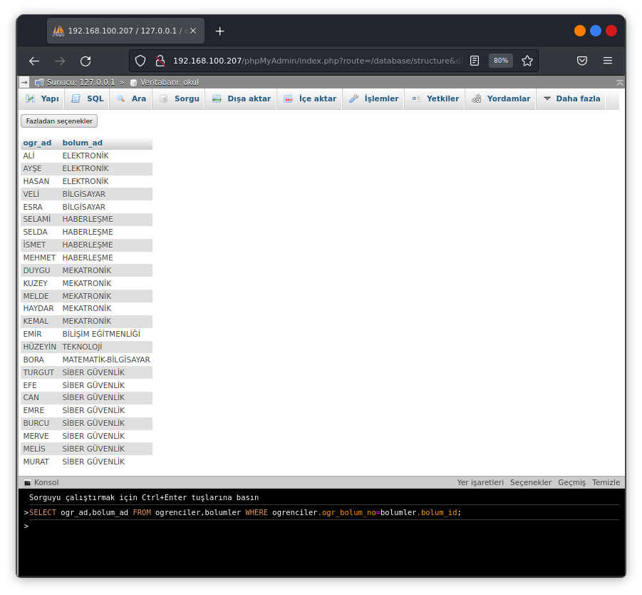
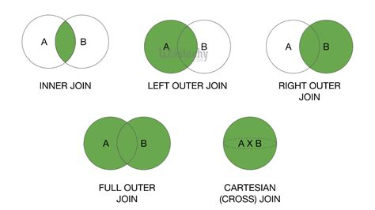
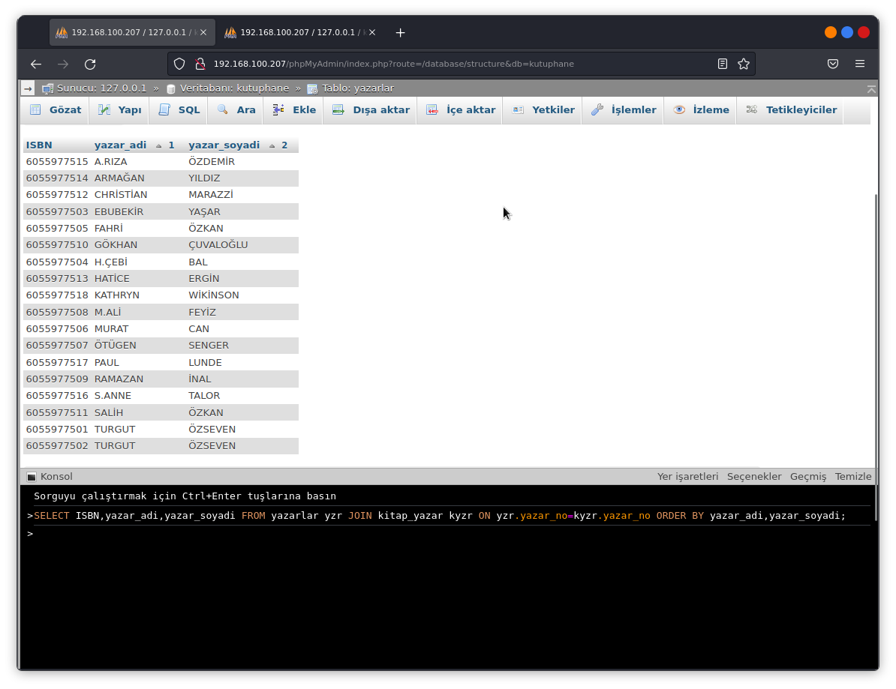
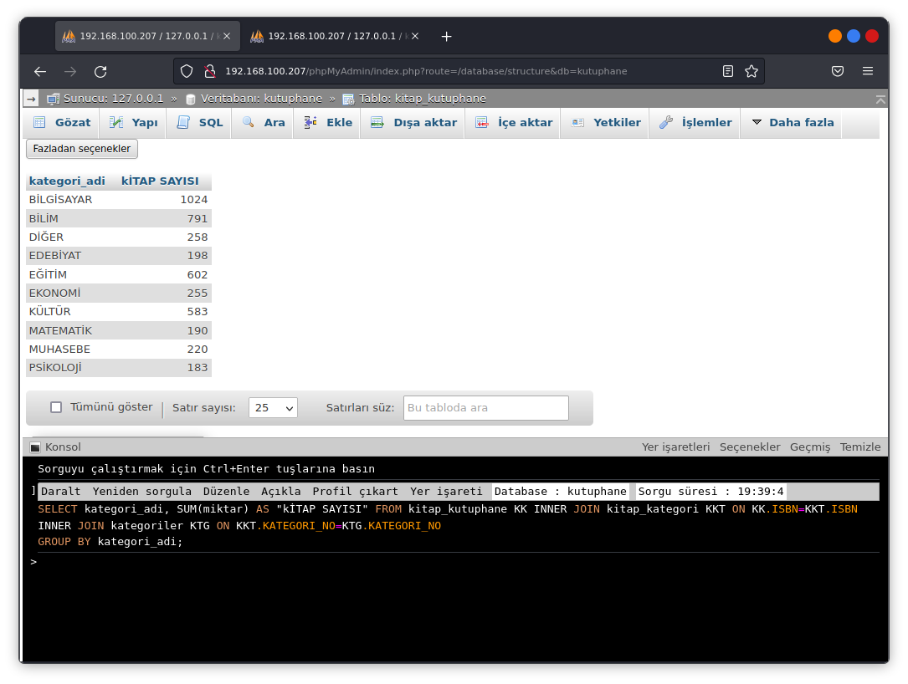
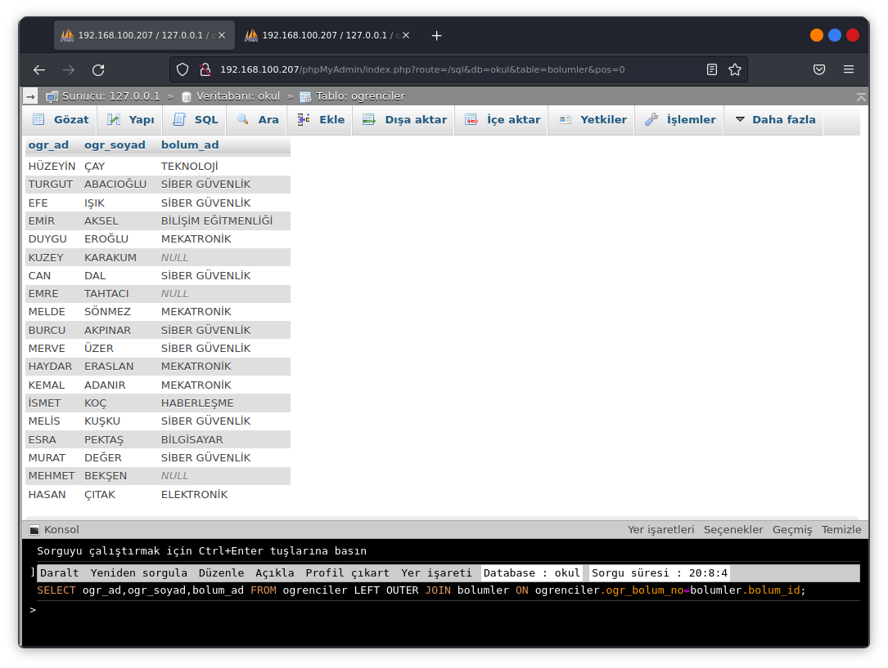
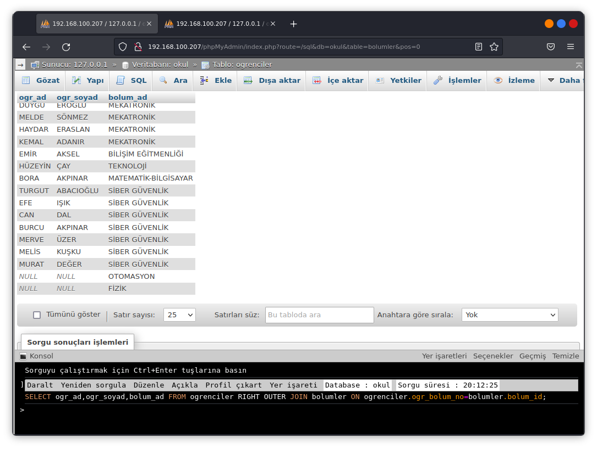
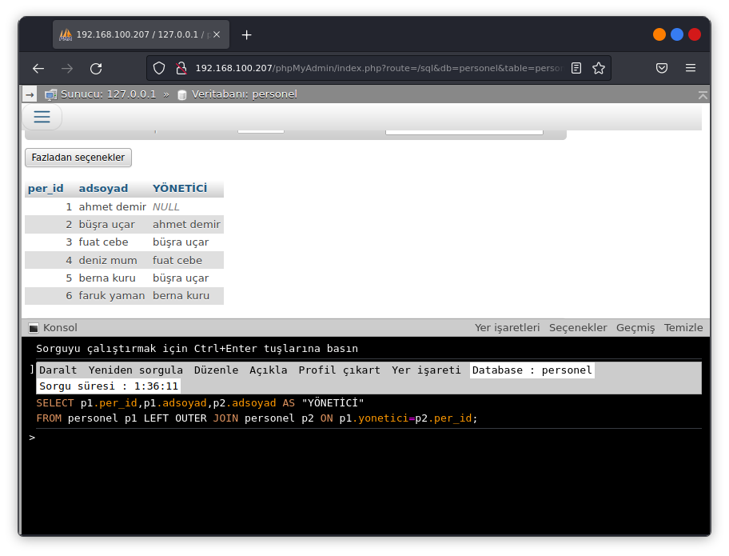
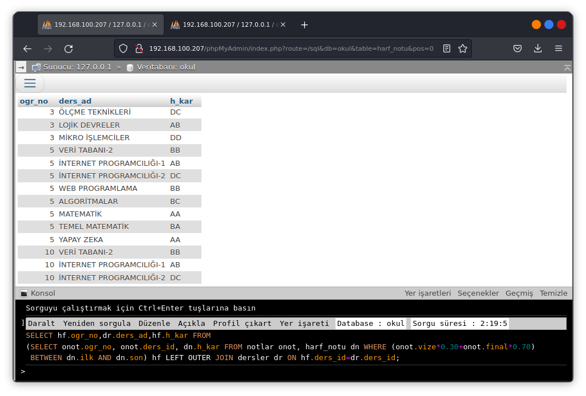
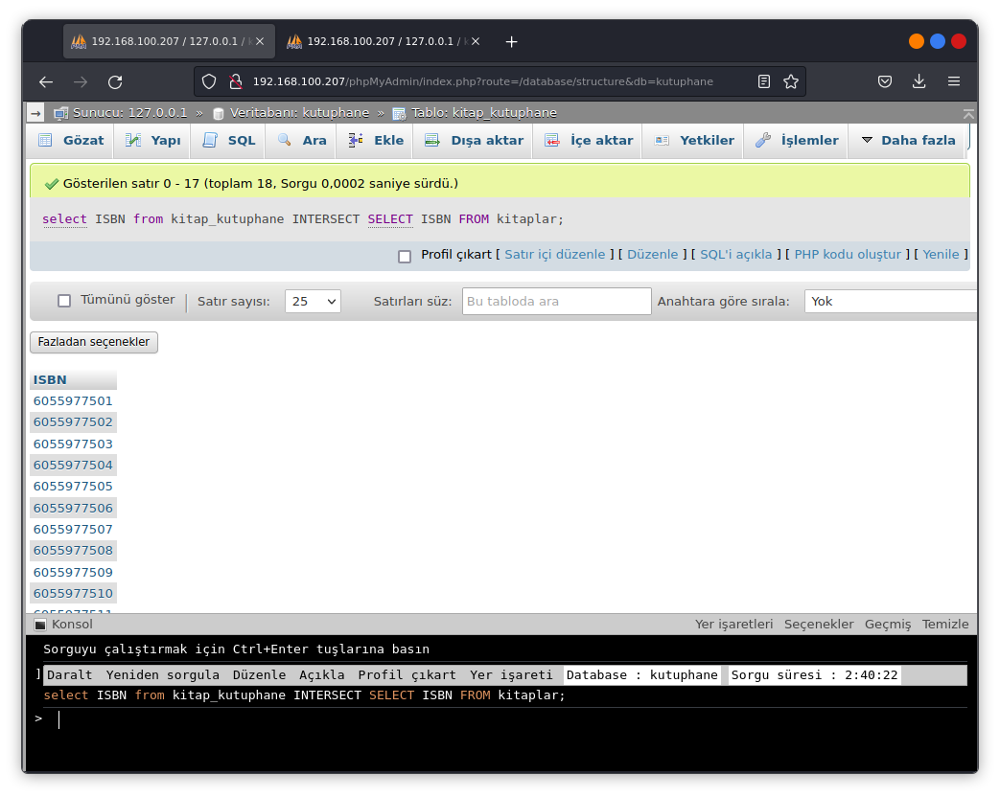

# Birden Fazla Tablo üzerinde Sorgulama
Birleştirme(join) yapılarak birden fazla tablo üzerinde sorgulama işlemleridir.Genel olarak farklı tablolar üzerindeki verilerin birleştirilerek gösterilmesidir.

## Tabloların Birleştirilmesi(JOIN)
Farklı tür değerler içeren farklı tabloların birleştirilmesine join işlemi denir.Tabloların yapılarında değişiklik olmaz sadece o anki sorgunun sonucu için kaynak oluşturulur.Birleştirme işlemi birden fazla tablo ile yapılabilir.



- Birleştirme işlemi için kullanılan tabloların yazılma sırası normal join işlemlerindeönemli değildir ama outer join işlemlerinde left table (sol tablo) ve right table(sağ tablo) olarak ayrılacaktır ve yazılma sırası önemli değildir.
- Birleştirme işlemi için join ifadeleri kullanılabileceği gibi yukarıdaki örnekte verildiği gibi WHERE ifadeside kullanılabilir.
- Birleştirme işlemi view üzerinde de uygulanabilir.
- Sorguların daha hızlı çalışması için birleştirilen sütunlar içni incex kullanılabilir.
- Birleştirilen sütunların veri tipi uyumlu olmalıdır.Binary veri tipleri içeren sütunlarda birleştirme işlemi yapılamaz.



### INNER JOIN
İki veya daha fazla tablonun ortak sütunlarının içerdiği verileri kontrol ederek birleştirme işlemi yapılır.INNER JOIN yerine JOIN yazmakta yeterlidir.



### OUTER JOIN
Inner join işleminde ilişkisi olan satırları gösterirken **OUTER JOIN** ilişkisi olmayan satırlarıda gösterir.İlişkilendirilen tablolarda karşılığı olamayan satırlar NULL değer içerecektir.Örnek olarak kütüphanede kitabı olmayan yazarlarda listelecektir.
1. LEFT OUTER JOIN
2. RIGHT OUTER JOIN
3. FULL OUTER JOIN

#### LEFT OUTER JOIN
Bu tür birleştirme kullanıldığında ifadenin solundaki tablodaki tüm satırlar gösterilir ve ilişkilendirilen ikinci tablonun ise sadece ilişki olan yani kesişimdeki satırları gösterilir.

#### RIGHT OUTER JOIN
Bu tür bir birleştirmede belirleyici tablo ifadenin sağındaki tablodur.

#### FULL OUTER JOIN
Bu tür birleştirmede her iki tabloda yada kaç tane tablo ile birleştirme işlemi yapıldıysa tüm satırlar gösterilir ve ilişkisi olmayan satırlar null değer içerecektir.Full outer join işlemi mysql de desteklenmiyor sadece mysql ve oracle veritabanlarında var.

```sql
SELECT tablo1.sutun_adi,tablo2.sütun_adi, ...
FROM tablo1 FULL OUTER JOIN tablo2 ON tablo1.
ortak_sütun(=,>,< >=,<=,<>)tablo2.ortak_sutun 
```

### CROSS JOIN (KARTEZYEN ÇARPIM)
**CROS JOIN** birleştirilen tablolardaki tüm satırların listelenmesini sağlar.Sorgu sonucu iki tablonun sayısının çarğımı kadar satırdan oluşmaktadır.
```sql
SELECT tablo1.sutun_adi,tablo2.sutun_adi ...
FROM tablo1 CROSS JOIN tablo2
```

### NATURAL JOIN (DOĞAL BİRLEŞTİRME)
**NATURAL JOIN** elde ettiği sonuç kümesi olarak INNER JOIN türü birleştirmeye benzer ancak koşul ifadesi belirtmeye gerek yoktur. Ortak sütunlar otomatik olarak birleştirilir tek bir sütun halinde gözükür.Diğer birleştirmelerde olan satır tekrarları **NATURAL JOIN** birleşimlerinde oluşmayacaktır.
```sql
SELECT tablo1.sutun_adi,tablo2.sutun_adi ...
FROM tablo1 NATURAL JOIN tablo2
```

### SELF JOIN (TABLONUN KENDİSİYLE BİRLEŞTİRİLMESİ)
**SELF JOIN** işlemi aslında diğer join işlemlerinin ve tabloları isimlendirme işleminin ortak kullanımıdır.

## ORTAK SÜTUNU BULUNMAYAN TABLOLARIN BİRLEŞTİRİLMESİ
Ortak sütunu bulunan tabloların birleştirilmesi için where veya join ifadeleriyle birleştirme yapılabilir.Ortak sütunu yok ise tabloların birleştirilmesi Aritmetik operatörler yerine **BETWEEN** ifadesi veya **<= AND >=** ifadesi kullanılabilir. 


## TABLOLARI KÜMELEME İFADELERİ İLE BİRLEŞTİRME
### İKİ SORGUNUN KESİŞİMİ(INTERSECT)
**INTERSECT** ifadesi aynı sütunlara sahip iki tablonun keşisimi bulmak için kullanılır.
```sql
SELECT * FROM tablo1 INTERSECT SELECT * FROM tablo2
```

### İKİ SORGUNUNUN FARKI
İki farklı sorgudan dönen aynı isimdeki sütunların farkını almak için kullanılır.İki kümenin birbirlerinden farkının toplamıdır.
```sql
SELECT * FROM tablo1 EXCEPT SELECT * FROM tablo2
```

### İKİ SORGUNUN BİRLEŞİMİ(UNION , UNION ALL)
**UNION** Kümelerdeki birleşim işlemi ile aynıdır.**UNION ALL** farkı her iki tablodada aynı satırlar varsa bunlar da sonuç olarak gösterilir ancak UNION işleminde her iki tabloda bulunan aynı satırlar sadece bir kez gösterilir.
```sql
SELECT sutun_adi FROM tablo1 UNION SELECT sutun_adi FROM tablo;
```
```sql
SELECT sutun_adi FROM tablo1 UNION ALL SELECT sutun_adi FROM tablo;
```