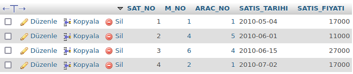
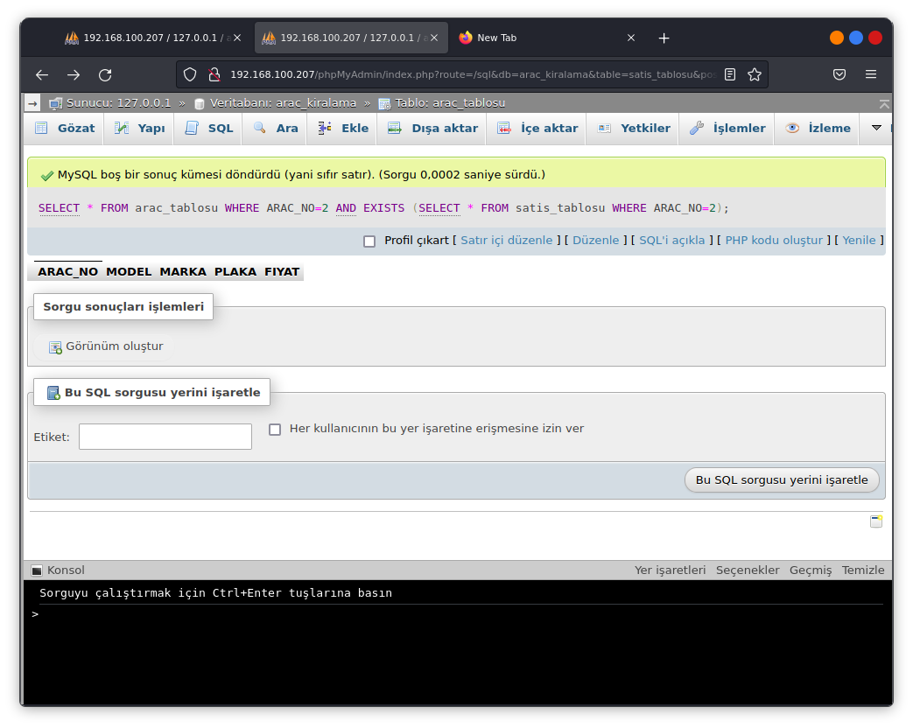
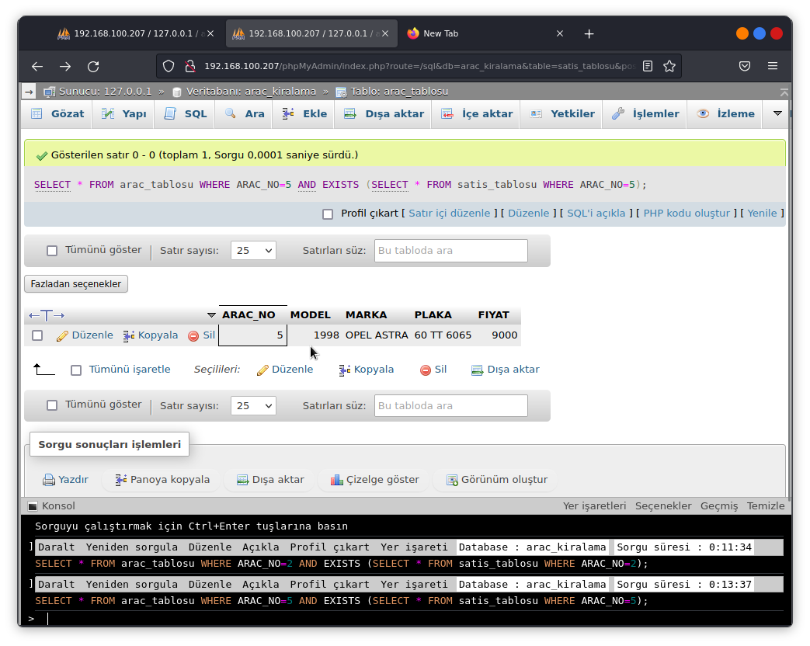
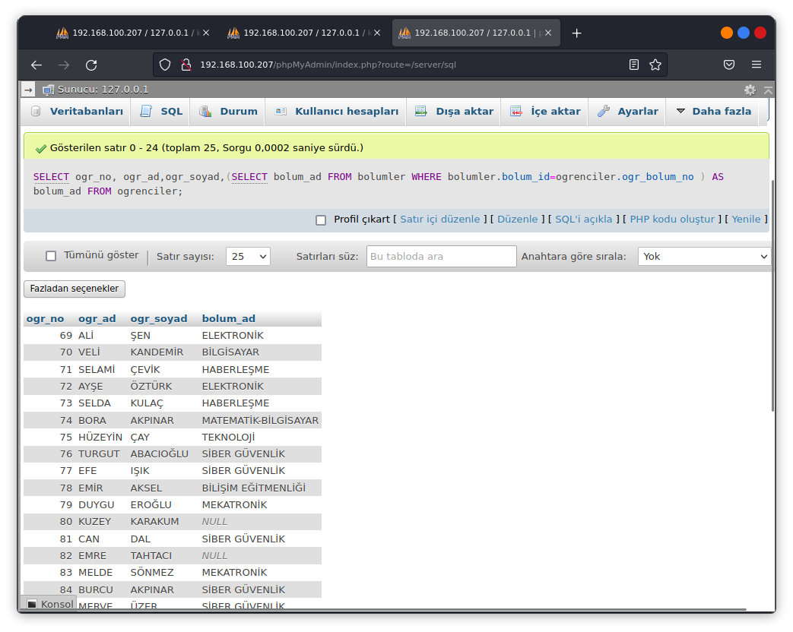
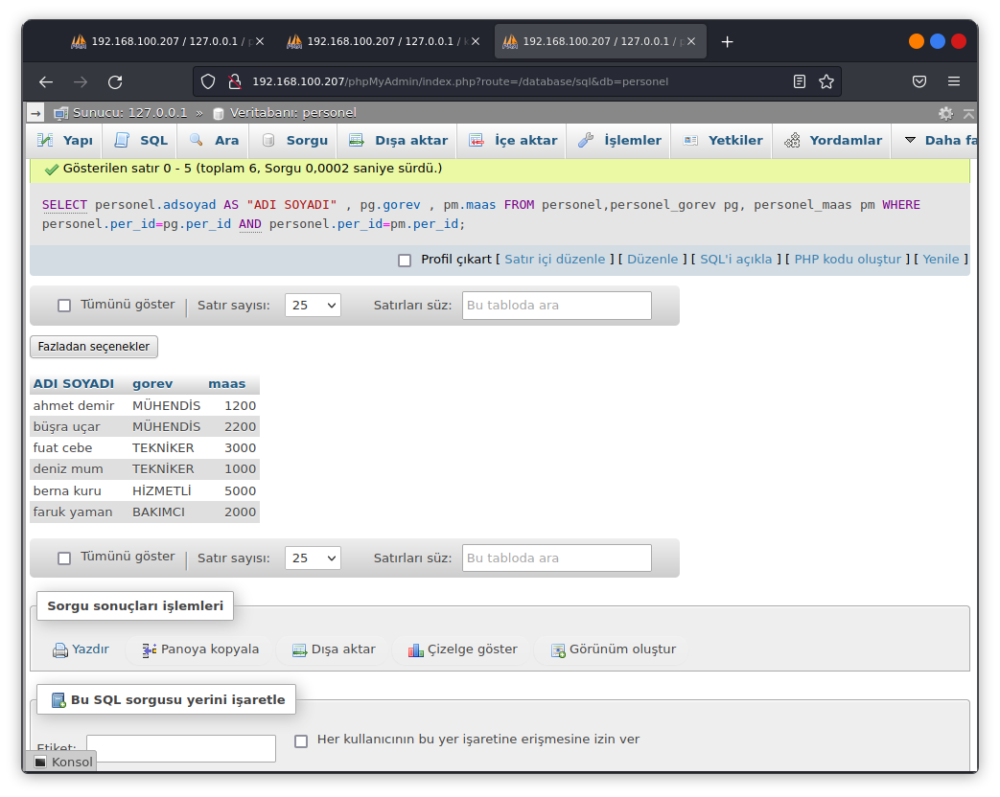

# ALT SORGULAR
Tabloların birleştirilmesi haricinde bu bölüme kadar kullanılan sorgular tek bir sorgudan oluşmaktadır.Alt sorgular bir sql sorgusunun içerisinde başka bir sql sorgusu kullanılarak oluşturulan sql ifadeleridir.Çoğunlukla sql ifadelerinin WHERE ve HAVING bölümlerinde kullanılır.Genel olarak bir sorgudan dönene değer diğer tablonun şart kısmını oluşturmaktadır.

- Alt sorgu içerisinde listelenecek sütun sayısı birden fazla olmamalıdır.
`(SELECT ad,soyad FROM TABLO)` yanlış bir ifadedir.
`(SELECT ad FROM TABLO)` doğru bir ifadedir.
- Alt sorgular parantez içerisine alınmalıdır.
- Alt sorgular ORDER BY yapısını içeremez.
- ORDER BY veya GROUP BY içerisinde alt sorgu kullanılamaz.
- İç içe kullanılacak alt sorguların sınırı veritabanına göre farklılık gösterir.
- Alt sorgu kendi FROM ifadesi veya diğer FROM ifadesinde belirtilen sütunları kullanabilir.
- Alt sorgu ve temel sorgu içerisinde sütun isimleri tablo_adi.sütun_adi şeklinde ve tabloya takma isimler verilerek kullanılabilir.
- Temel sorgunu koşul kısmında karşılaştırma operatörleri kullanıldığğı zaman alt sorgudan tek değer dönmesi gerekir alt sorgudan dönen değer birden fazlaysa koşul kısmında IN veya NOT IN gibi çoklu değerleri karşılaştırmak için kulanılan ifadeler kullanılmalıdır.


## ALT SORGULARDA IN VE NOT IN KULLANIMI
Sorgudan dönen değerlerin birden fazla olduğu durumlarda koşul ifadesi bölümünde IN veya NOT IN ifadeleri kullanılabilir.

**SORGU 1**

**SORGU 2**


## ALT SORGULARDA GROUP BY ve HAVING kULLANIMI
Temel sorguların koşul değerlerini oluşturan alt sorgularda koşullu gruplandırma işlemleri yapılabilir.
```sql
SELECT * FROM kitaplar WHERE fiyat>(
    SELECT MIN(fiyat) FROM kitaplar
    GROUP BY konu HAVING konu='BİLGİSAYAR'
)
```

## ALT SORGULARDA ANY VE ALL KULLANIMI
**ANY** temel sorguda belirtilen koşul ifadei için alt sorgudan dönen herhangi bir grup verinin birini sağlayan durumlar için kullnılır.Personel tablosunda teknikerlerden daha maaş alan mühendislerin bilgilerini getiren sql sorguları.


**ALL** temel sorguda belirtilen koşul ifadesi için alt sorgudan dönen bir grup verinin tamamını sağlayan durumlar için kullanılır.

## ALT SORGULARDA EXISTS VE NOT EXISTS KULLANIMI
**EXISTS** alt sorgudan dönen değerin olul olmadğını kontrol etmek için kullanılır.EXIST ifadesi temel sorgunun koşul kısmını oluşturmaktadır.Alt sorgu sonucunda eğer 1 satır dönerse temel sorgunun koşul kısmı TRUE değerini alacağı için temel sorgu işlevini gerçekleştirir.Eğer bir satır dahi dönmesse false değerini alır ve temel sorgu koşulu sağlanmamış olur. **NOT EXISTS** bunun tam tersidir.

Alt SORGULAR oluşturulurken tek bir sütun dönmesi gerekiyordu ancak EXIST kullanımların böyle kısıt yoktur.
```sql
SELECT * FROM satici
WHERE EXISTS (
    SELECT * FROM satis
    WHERE satici_n=satici AND parca_n=27
)
```

**örnek**
satış tablosundaki bir aracın kontrol edilmesi




## SÜTUN İSİMLERİNDE ALT SORGU KULLANIMI
Alt sorgular koşul ifadelerinin dışındada kullanılabilir.

## FROM İFADESİNDE ALT SORGU KULLANIMI
Alt sorgudan üretilen değerler from ifadesi için tablo kaynağı olarakta kullanılabilir.

